1. 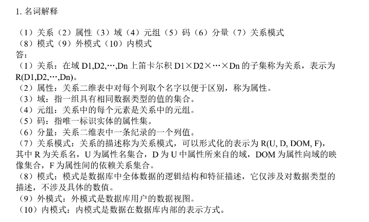

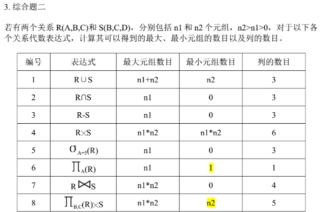

```mysql
#建用户
create role U1;
#给权限   grant 权限 on 表 to 用户 with admin option//给别人
grant all privileges on  work3.student TO U1 WITH ADMIN OPTION;
#去权限
revoke 权限 on 表 from 用户

#触发器

create trigger f1
    before insert on 表
    for each row
begin
    
end；


#聚合
select course_id,COUNT(*) as num#求出数量
from course_selection
group by course_id#聚合后为包括course_id的所有在一行，非聚合不能显示
having count(*)>=2;#having 是对group by出来结果的再筛选

#连接
select student.id,name,course_id,score from work8.student
join course_selection cs on student.id = cs.student_id;
order by score desc ;#实现降序排列
#join 自然连接

#no exists
select name from work8.student
where not exists(select * from course,course_selection
    where course.name='java程序设计'
      and course_id=course.id and student.id=course_selection.student_id
    );
#student 使用是外围的student 返回的是当前遍历到的student是否有这样的特质

#事务
set @course_p=0;//参数

create procedure borrow (in usernames char(10),ages char(10), Bookids char(10), ReturnTime int)
begin
    
end ;


#视图
create view 50to100
as select *
from book where price>=50 and price<=100;
#索引
create index two on book(price);

#约束
alter table book add constraint one1 check ( Book.translated ='是'or Book.translated='否');

#插改删
insert into 表 value  xxx ; 
update 表 set xxx xxx  where  ;
delete from 表 where xxxx;

#完整建表
create table student(
    id int primary key auto_increment,
    name varchar(20) not null,
    gender ENUM('男','女') not null,
    birthday date not null,
    class_id int not null ,
    foreign key (class_id) references class(id)
);

where name like'陈%'and gender='男';
where birthday<'1990-05-01'and gender='女';
where title!='教授';
where id IN('a005','a008');
union连接两个语句
```

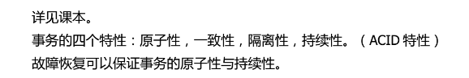

什么时候要重做，什么时候要回滚？

提交会重做，其他进行或者回滚的会回滚，未开始的不管。


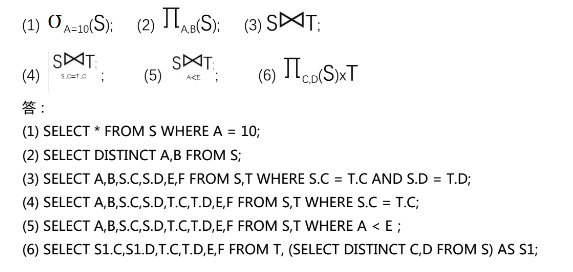

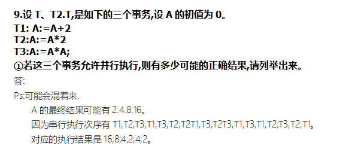

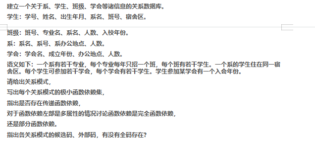

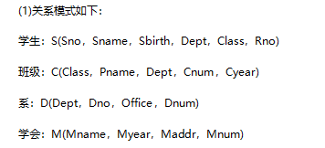


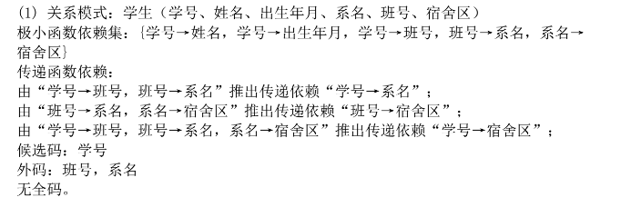

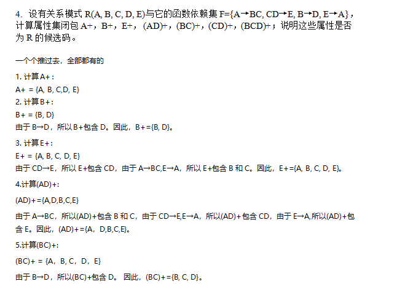

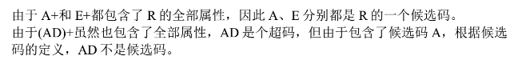

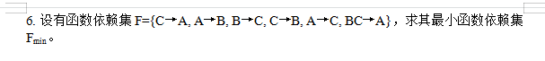

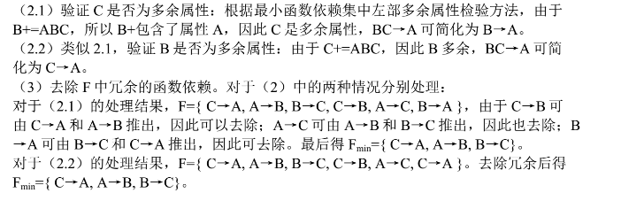

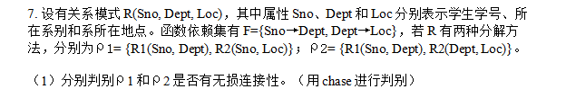

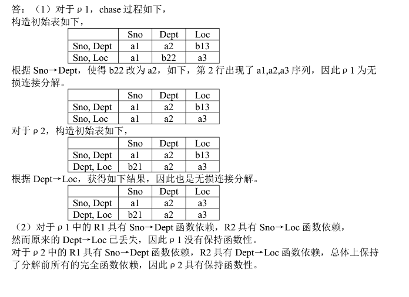

原来的还在关系就行


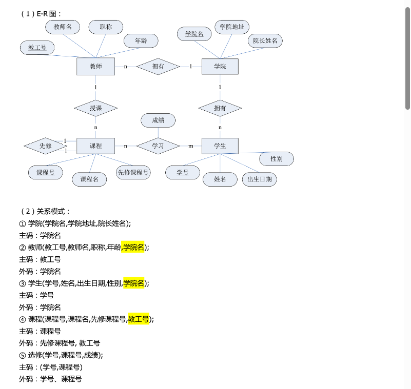

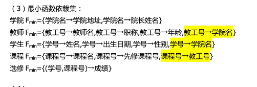