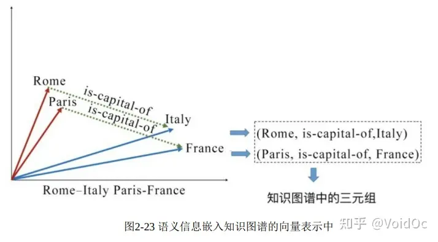
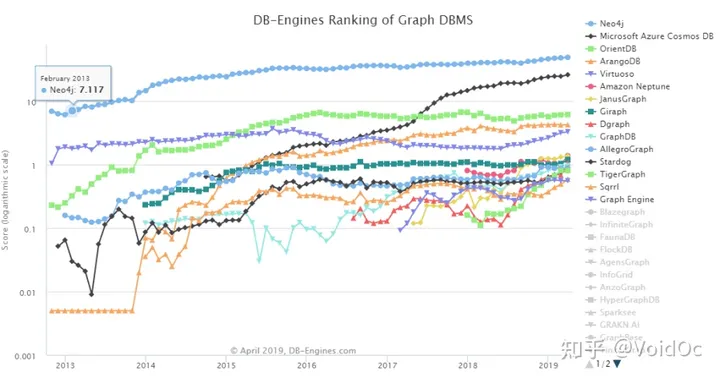
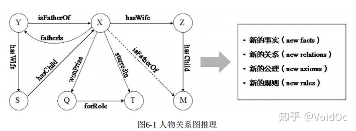
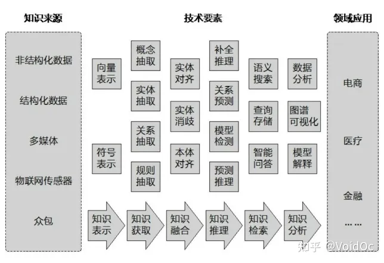
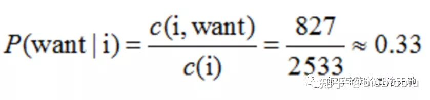
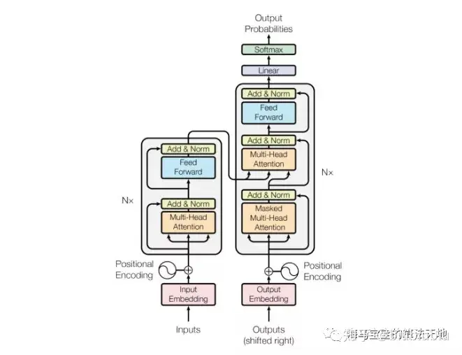
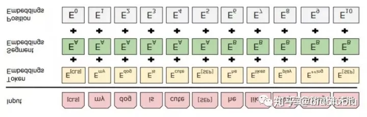

# 3【知识图谱】知识图谱（一）—— 综述


[【知识图谱】知识图谱（一）—— 综述 - 知乎 (zhihu.com)](https://zhuanlan.zhihu.com/p/352088232)

阿里巴巴 算法工程师

已关注

> **目录**
> **一、介绍**
> **二、知识图谱表示**
> 2.1 知识构建
> 2.1.1 知识从哪来？
> 2.1.2 知识长啥样？—— 知识表示
> 2.1.3 知识抽取/挖掘
> 2.1.4 知识存储
> 2.2 知识融合
> 2.3 知识推理
> 2.3.1 基于逻辑规则的推理
> 2.3.2 基于图结构的推理
> 2.3.3 基于分布式表示的推理
> 2.3.4 基于神经网络的推理
> **三、应用实例**
> **四、总结**

麻烦知乎赶紧出文章目录索引好吧

## 前言：

> 本文为在知识图谱领域研读陈华均老师的书籍，与会CCKS2020、华为网络天下2020，结合相关知识在一些具体算法场景做出一定程度的应用后的个人知识总结笔记。在学习过程中看了很多paper或教程，整理起来放到这里备忘，列表会随着我的学习不断更新。

- **书籍推荐：**

> 《知识图谱——方法、实践与应用》陈华钧

- **论文推荐：**

> **知识表示**
> 《A Review of Relational Machine Learning for Knowledge Graphs》[[1\]](https://zhuanlan.zhihu.com/p/352088232#ref_1)
> 《Knowledge Graph Embedding with Iterative Guidance from Soft Rules》[[2\]](https://zhuanlan.zhihu.com/p/352088232#ref_2)
> **知识抽取**
> 《Neural Architectures for Named Entity Recognition》[[3\]](https://zhuanlan.zhihu.com/p/352088232#ref_3)
> 《End-to-end Sequence Labeling via Bi-directional LSTM-CNNs-CRF》[[4\]](https://zhuanlan.zhihu.com/p/352088232#ref_4)
> 《Joint Extraction of Multiple Relations and Entities by using a Hybrid Neural Network》[[5\]](https://zhuanlan.zhihu.com/p/352088232#ref_5)
> 《Distant Supervision for Relation Extraction with Sentence-Level Attention and Entity Descriptions》[[6\]](https://zhuanlan.zhihu.com/p/352088232#ref_6)
> 《归纳逻辑程序设计综述》[[7\]](https://zhuanlan.zhihu.com/p/352088232#ref_7)
> 《Reinforcement Learning for Relation Classification from Noisy Data》[[8\]](https://zhuanlan.zhihu.com/p/352088232#ref_8)
> **知识推理：**
> 《Open world Knowledge Graph Completion》[[9\]](https://zhuanlan.zhihu.com/p/352088232#ref_9)
> 《RNNLOGIC: LEARNING LOGIC RULES FOR REASONING ON KNOWLEDGE GRAPH》[[10\]](https://zhuanlan.zhihu.com/p/352088232#ref_10)

## 一、介绍：

知识图谱的早期理念源于万维网之父Tim Berners-Lee关于语义网 （The Semantic Web）的设想，旨在采用图结构（Graph Structure）来建 模和记录世界万物之间的关联关系和知识，以便有效实现更加精准的对 象级搜索。知识图谱的相关技术已经在搜索引擎、智能问答、语言理 解、推荐计算、大数据决策分析等众多领域得到广泛的实际应用。近年 来，随着自然语言处理、深度学习、图数据处理等众多领域的飞速发展，知识图谱在自动化知识获取、知识表示学习与推理、大规模图挖掘与分析等领域又取得了很多新进展。知识图谱已经成为实现认知层面的 人工智能不可或缺的重要技术之一。


## 二、知识图谱表示

## 2.1 知识构建

**2.1.1 知识从哪来？**

想要构建知识，首先需要有数据来源。互联网的发展为知识海量来源提供了新的机遇。在一定程度上，互联网的出现帮助传统知识工程突破了在知识获取方面的瓶颈。从1998年Tim Berners Lee提出语义网至今，涌现出了大量以互联网资源为基础的新一 代知识库。这类知识库的构建方法可以分为三类：**众包**、**专家协作**和**互联网挖掘**。

以卡内基梅隆大学开发的知识库NELL（Never-Ending Language Learner）为例：NELL主要采用互联网挖掘的方法从Web中自动抽取**三元组（SPO）知识**。NELL的基本理念是：给定一个初始的本体（少量类和关系的定义）和少量样本，让机器能够通过自学习的方式不断地从Web中学习和抽取新的知识。目前，NELL已经抽取了300多万条三元组知识。

而专家协作常见于领域知识图谱的构建，因为专业领域知识抽取的质量要求相较于通用领域知识图谱，更高。下图对比介绍了领域知识图谱的主要特点及技术难点：


以医疗领域的知识图谱项目Linked Life Data 为例，该项目包含的RDF三元组规模就达到102亿个，包含从基因、 蛋白质、疾病、化学、神经科学、药物等多个领域的知识。再例如国内构建的中医药知识图谱，通常需要融合各类基础医学、文献、医院 临床等多种来源的数据，规模也达到20多亿个三元组。医学领域的知识 结构更加复杂，如医学语义网络 UMLS 包含大量复杂的语义关系，GeneOnto则包含复杂的类层次结构。在知识质量方面，特别涉及临床辅助决策的知识库通常要求完全避免错误知识。

而从数据源的类型上来分类，我们可以获得包括文本、图像数据、多媒体数据、传感器数据等多模态数据。但每一种数据源的**知识化**都需要综合各种不同的技术手段。例如，对于文本数据源，需要综合实体识别、 实体链接、关系抽取、事件抽取等各种自然语言处理技术，实现从文本中抽取知识。 此外，还需要综合采用实体消歧、数据融合、知识链接等技术，提升数据的规范化水平，增强数据之间的关联。 语义技术也被用来对传感器产生的数据进行语义化。这包括对物联设备进行抽象，定义符合语义标准的数据接口；对传感数据进行语义封装和对传感数据增加上下文语义描述等。

人工众包是获取高质量知识图谱的重要手段。例如，Wikidata和 [http://Schema.org](https://link.zhihu.com/?target=http%3A//Schema.org)都是较为典型的知识众包技术手段。可以开发针对 文本、图像等多种媒体数据的语义标注工具，辅助人工进行知识获取。

**2.1.2 知识长啥样？—— 知识表示**

有了来源以后，知识应该怎么被定义呢？

这里就需要涉及到**知识表示**与Schema工程等相关技术了。知识表示是指用计算机符号描述和表示人脑中的知识，以支持机器模拟人的心智进行推理的方法与技术。早期专家们用语义网、逻辑描述来刻画显示、离散的知识（比如一阶谓词逻辑、霍恩子句和霍恩逻辑），因而具有内生的可解释性。完全基于符号逻辑的知 识表示通常由于知识的不完备而失去鲁棒性。

随着语义网的提出与互联网的发展，知识表示迎来了新的契机和挑战，契机在于语义网为知识表示提供了一个很好的应用场景，挑战在于面向语义网的知识表示需要提供一套标准语言可以用来描述Web的各种信息。早期Web 的标准语言HTML和XML无法适应语义网对知识表示的要求，所以W3C 提出了新的标准语言**RDF**、**RDFS和OWL**。相关概念我觉得这篇文章介绍地比较好：

[SimmerChan：知识图谱基础之RDF，RDFS与OWL970 赞同 · 64 评论文章](https://zhuanlan.zhihu.com/p/32122644)

- **常见的知识图谱的知识表示框架**

> **Freebase**

Freebase 的知识表示框架主要包含如下几个要素：对象-Object、事 实-Facts、类型-Types和属性-Properties。“Object”代表实体。每一 个“Object”有唯一的 ID，称为 MID （Machine ID）。一个“Object”可以 有一个或多个“Types”。“Properties”用来描述“Facts”。

例如，“Barack Obama”是一个 Object，并拥有一个唯一的 MID:“/m/02mjmr”。这个 Object 的一个 type 是“/government/us_president”，并有一个称 为“/government/us_president/presidency_number”的Property，其数值 是“44”。Freebase使用复合值类型（Compound Value Types,CVT）处理多元关系。


Freebase的知识表示结构示例

> **Wikidata**

Wikidata 的知识表示框架主要包含如下要素：页面-Pages、实体Entities、条目-Items、属性-Properties、陈述-Statements、修饰Qualifiers、引用-Reference 等。

Wikidata 起源于Wikipedia，因此与 Wikipedia 一样，以页面“Page”为基本的组织单元。Entities 类似于 OWL:Things，代指最顶层的对象。每一个 Entity 都有一个独立的维基页面。Entities 主要有两类：Items 和 Properties。Items 类似于 RDF 中的 Instance，代指实例对象。Properties和Statements分别等价于RDF中的 Property和Statement。通常一个Item的页面还包含多个别名-aliases和多 个指向Wikipedia的外部链接-Sitelinks。 每个 Entities 有多个 Statements。一个 Statement 包含一个 Property、一个或多个Values、一个或多个Qualifiers、一个或多个 References、一个标识重要性程度的Rank。

> **ConceptNet**

ConceptNet5的知识表示框架主要包含如下要素：概念-Concepts、 词-Words、短语-Phrases、断言-Assertions、关系-Relations、边-Edges。

Concepts由Words或Phrases组成，构成了图谱中的节点。与其他知识图 谱的节点不同，这些 Concepts 通常是从自然语言文本中提取出来的， 更接近自然语言描述，而不是形式化的命名。Assertions 描述了Concepts 之间的关系，类似于RDF中的Statements。Edges类似于RDF中的 Property。一个 Concepts 包含多条边，而一条边可能有多个产生来源。 例如，一个“化妆 Cause 漂亮”的断言可能来源于文本抽取，也可能来源 于用户的手工输入。来源越多，该断言就越可靠。ConceptNet5根据来 源的多少和可靠程度计算每个断言的置信度。ConceptNet5示例如图所示。


ConceptNet5示例

ConceptNet5中的关系包含21个预定义的、多语言通用的关系，如 IsA、UsedFor等，以及从自然语言文本中抽取的更加接近自然语言描述 的非形式化的关系，如 on top of,caused by等。

------

在前面提到的一些知识图谱的表示方法中，其基础大多是以三元组的方法对知识进行组织。虽然这种离散的符号化的表达方式可以非常有效地将数据结构化，但这些符号并不能在计算机 中表达相应语义层面的信息，也不能进行语义计算，对下游的一些应用并不友好。

随着表示学习的发展， 以及NLP领域**词向量**等**嵌入（Embedding）**技术手段的出现， 启发了人们用类似于词向量的低维稠密向量的方式表示知识。

通过嵌入将知识图谱中的实体和关系投射到一个低维的连续向量空间，可以为每一个实体和关系学习出一个低维度的向量表示。

这种基于连续向量的知识表示可以实现通过数值运算来发现新事实和新关系，并能更有效发现 更多的隐式知识和潜在假设，这些隐式知识通常是人的主观不易于观察和总结出来的。更为重要的是，知识图谱嵌入也通常作为一种类型的先验知识辅助输入很多深度神经网络模型中，用来约束和监督神经网络的训练过程。

> 如图所示为基于离散符号的知识表示与基于连续向量的知识表示对比。


- **知识图谱的向量表示**

> 在介绍有关知识图谱的向量表示方法之前，在此先介绍词的表示方法，可以参考我的另一篇学习笔记： [VoidOc：【深度学习】详解TextCNN](https://zhuanlan.zhihu.com/p/129808195)

为了解决前面提到的知识图谱表示的挑战，在词向量的启发下，研究者考虑如何将知识图谱中的实体和关系映射到连续的向量空间，并包含一些语义层面的信息，可以使得在下游任务中更加方便地操作知识图谱，例如KBQA、关系抽取等。对于计算机来说，连续向量的表达可以蕴涵更多的语义，更容易被计算机理解和操作。把这种将知识图谱中包括实体和关系的内容映射到连续向量空间方法的研究领域称为**知识图谱嵌入（Knowledge Graph Embedding）**、**知识图谱的向量表示**、 知识图谱的**表示学习（Representation Learning）**或者**知识表示学习**。

类似于词向量，知识图谱嵌入也是通过机器学习的方法对模型进行学习，与One-Hot编码、词袋模型的最大区别在于，知识图谱嵌入方法的训 练需要基于监督学习。在训练的过程中，可以学习一定的语义层信息， 词向量具有的空间平移性也简单地说明了这点。类似于词向量，经典的知识图谱嵌入模型TransE的设计思想就是，如果一个三元组（h, r, t）成 立，那么它们需要符合h+r ≈ t关系，例如： vec（Rome）+vec（is−capital−of）≈vec（Italy）



- **知识图谱嵌入的主要方法**

**1）转移距离模型：**如TransE

**2）语义匹配模型：**如RESCAL

RESCAL模型的核心思想是将整个知识图谱编码为一个三维张量， 由这个张量分解出一个核心张量和一个因子矩阵，核心张量中每个二维 矩阵切片代表一种关系，因子矩阵中每一行代表一个实体。由核心张量 和因子矩阵还原的结果被看作对应三元组成立的概率，如果概率大于某 个阈值，则对应三元组正确；否则不正确。其得分函数可以写成


**3）考虑附加信息的模型**

除了仅仅依靠知识库中的三元组构造知识图谱嵌入的模型，还有一 些模型考虑额外的附加信息进行提升。 实体类型是一种容易考虑的额外信息。在知识库中，一般会给每个 实体设定一定的类别，例如Rome具有city的属性、Italy具有country的属 性。最简单的考虑实体类型的方法是在知识图谱中设立类似于IsA这样 的可以表示实体属性的关系，例如 （Rome,IsA,city） （Italy,IsA,Country） 这样的三元组。当训练知识图谱嵌入的时候，考虑这样的三元组就 可以将属性信息考虑到向量表示中。也有一些方法考虑相同类型的 实体需要在向量表示上更加接近。 关系路径也可以称为实体之间的多跳关系（Multi-hop Relationships），一般就是指可以连接两个实体的关系链，例如（Rome,is−capital−of,Italy） （Italy,is−country−of,Europe）. 从 Rome 到 Europe 的关系路径就是一条is−capital−of→is−country −of关系链。当前很多方法也尝试考虑关系路径来提升嵌入模型，这里 的关键问题是考虑如何用相同的向量表达方式来表达路径。

在基于路径 的 TransE，也就是 PTransE[[11\]](https://zhuanlan.zhihu.com/p/352088232#ref_11) 中，考虑了相加、相乘和RNN三种用关系 表达关系路径的方法：


在基于 RNN 的方法中，令c1=r1并且一直遍历路径中的关系，直到最终p=cn。对于某一个知识库中存在的三元组，其两个实体间的关系路径p需要和原本两个实体间关系的向量表示相接近。

逻辑规则（Logical Rules）也是常被用来考虑的附加信息，Guo[[12\]](https://zhuanlan.zhihu.com/p/352088232#ref_12)提出了一种以规则为指导的知识图谱嵌入方法，其中提出的**软规则（Soft rule）**指的是**使用 AMIE+规则学习方法在知识图谱中挖掘的带有置信度的规则。**该方法的整体框架是一个迭代的过程，其中包含两个部分，称为软标签预测阶段 （Soft Label Prediction）和嵌入修正阶段（Embedding Rectification）。 简单来说，就是讲规则学习和知识图谱嵌入学习互相迭代，最后使得知识图谱嵌入可以融入一定的规则信息。

- **知识图谱嵌入的应用（其实也是知识推理的应用）：**

**1）关系（链接）预测：**指通过一个已知的实体和关系预测另 一个实体，或者通过两个实体预测关系。

**2) 三元组评估（fact prediction）：**指的是给定一个完整的三元组， 判断三元组的真假。这对于训练过的知识图谱向量来说非常简单，只需要把三元组各个部分的向量表达带入相应的知识图谱嵌入的得分函数， 三元组的得分越高，其合理性和真实性越高。

**3）实体对齐：**是验证两个实 体是否指代或者引用的是同一个事物或对象。该任务可以删除同一个知识库中冗余的实体，也可以在知识库融合的时候从异构的数据源中找到相同的实体。一种方法是，如果需要确定 x、y 两个实体指代同一个对象有多大可能，则使用知识图谱嵌入的得分函数对三元组(x, EqualTo, y) 打分，但这种方法的前提是需要在知识库中存在 EqualTo 关系。也有研究者提出完全根据实体的向量表示判断，例如设计一些实体之间的相似 度函数来判断两个实体的相似程度，再进行对齐。

**4）QA问答**：利用知识图谱完成问答系统是该任务的一个研究方向，该任务的重 心是对某一个具体的通过自然语言表达的问题，使用知识图谱中的三元 组对其进行回答，如下：

> A: Where is the capital of Italy？
> Q: Rome（Rome, is-capital-of, Italy）
> A: Who is the president of USA？
> Q: Donald Trump（Donald Trump, is-president-of, USA）

------

**2.1.3 知识抽取/挖掘**

- **知识抽取**按任务可以分为**实体识别、关系抽取、事件抽取和规则抽取**等。

传统专家系统时代的知识主要依靠专家手工录入，难以扩大规模。现代知识图谱的构建通常大多依靠已有的结构化数据资源进行转化，形成基础数据集，再依靠自动化知识抽取和知识图谱补全技术，从多种数据来源进一步扩展知识图谱，并通过人工众包进一步提升知识图谱的质量。这部分内容比较多，另开一篇专门来写：

[VoidOc：知识图谱（二）—— 知识抽取与知识挖掘76 赞同 · 3 评论文章](https://zhuanlan.zhihu.com/p/352513650)

**2.1.4 知识存储**

和传统数据一样，知识也需要数据库来进行存放与管理工作。由于传统关系数据库无法有效适应知识图谱的图数据模型， 知识图谱领域形成了 负责存储**RDF图（RDF graph）**数据的**三元组库（Triple Store）**，和管理**属性图（Property Graph）**的**图数据库（Graph Database）**。

- **RDF图**

> 在 RDF 三元组集合中，每个 Web 资源具有一个 HTTP URI 作为其唯一的 id；一个 RDF图定义为三元组(s, p, o)的有限集合；每个三元组代表一个陈述句，其中s是主语，p是谓语，o是宾语； (s, p, o)表示资源s与资源o之间具有联系p，或表示资源s具有属性p且其 取值为o。实际上，RDF三元组集合即为图中的有向边集合。


RDF图示例

值得注意的是，RDF 图对于节点和边上的属性没有内置的支持。节点属性可用三元组表示，这类三元组的宾语称为**字面量**，即图中的**矩形**。边上的属性表示起来稍显烦琐，最常见的是利用 RDF 中一种叫 作**“具体化”（reification）**的技术[[13\]](https://zhuanlan.zhihu.com/p/352088232#ref_13)，需要引入额外的点表示整个三元组，将边属性表示为以该节点为主语的三元组。例如在图3-2中，引入节点ex:participate 代表三元组(ex:zhangsan， 参加， ex:graphdb)，该节点通过 RDF 内置属性rdf:subject、rdf:predicate 和 rdf:object 分别与代表 的三元组的主语、谓语和宾语建立起联系，这样三元组(ex:participate， 权重， 0.4)就实现了为原三元组增加边属性的效果。


- **属性图**

属性图可以说是目前被图数据库业界采纳最广的一种图数据模型。属性图由节点集和边集组成，且满足如下性质：

```text
（1）每个节点具有唯一的id； 
（2）每个节点具有若干条出边； 
（3）每个节点具有若干条入边； 
（4）每个节点具有一组属性，每个属性是一个键值对； 
（5）每条边具有唯一的id； 
（6）每条边具有一个头节点； 
（7）每条边具有一个尾节点； 
（8）每条边具有一个标签，表示联系； 
（9）每条边具有一组属性，每个属性是一个键值对。 
```

图3-3给出的属性图不仅表达了RDF图的全部数据，而且还增加了边上的“权重”属性。


知识图谱查询语言可分为**声明式 （Declarative）**和**导航式（Navigational）**两类。

> 图数据库上的声明式查询语言有： **Cypher、PGQL 和 G-Core。**
> Cypher 是开源图数据库 Neo4j 中实现的图查询语言。PGQL 是 Oracle 公司开发的图查询语言。G-Core是由 LDBC（Linked Data Benchmarks Council）组织设计的图查询语言。这里不展开，感兴趣的同学自己细查。

- **常见的知识图谱存储方法**

目前，基于三元组库和图数据库能够提供的知识图谱数据存储方案 可分为三类：

**（1）基于关系数据库的存储方案：**包括三元组表、水平表、属性表、垂直划分、六重索引和DB2RDF等。

**1.三元组（SPO）表**是将知识图谱中的每条三元组存储为一行具有三列的记录 （主语，谓语，宾语）。三元组表存储方案虽然简单明了，但三元组表的行数与知识图谱的边数一样，其问题是将知识图谱查询翻译为SQL后会产生大量三元组表的自连接操作，影响效率。


**2.水平表**存储方案的每行记录存储知识图谱中一个主语的所有谓语和宾语，相当于知识图谱的邻接表。但其缺点在于所需列数目过多，表中产生大量空值，无法存储多值宾语等。


水平表

**3.属性表**存储方案将同一类主语分配到一个表中，是对水平表存储方案的细化。属性表解决了三元组表的自连接问题和水平表的列数目过多问题。但对于真实大规模知识图谱，属性表的问题包括：所需属性表过多，复杂查询的多表连接效率，空值问题和多值宾语问题。


属性表

**4.垂直划分**[[14\]](https://zhuanlan.zhihu.com/p/352088232#ref_14)存储方案为知识图谱中的每种谓语建立一张两列的表（主语，宾语），表中存放由该谓语连接的主语和宾语，支持“主语-主语”作为连接条件的查询操作的快速执行。垂直划分有效解决了空值问题和多值宾语问题；但其仍有缺点，包括：大规模知识图谱的谓语表数目过多、复杂查询表连接过多、更新维护代价大等。


垂直划分存储方案

**5.六重索引**存储方案是对三元组表的扩展，是 一种典型的“空间换时间”策略，其将三元组全部6种排列对应地建立为6 张表，即 spo (主语， 谓语， 宾语)、pos (谓语， 宾语， 主语)、osp (宾 语， 主语， 谓语)、sop (主语， 宾语， 谓语)、pso (谓语，主语， 宾语) 和ops (宾语， 谓语， 主语)。不难看出，其中spo表就是原来的三元组 表。六重索引通过6张表的连接操作不仅缓解了三元组表的单表自连接 问题，而且加速了某些典型知识图谱查询的效率。使用六重索引方法的 典型系统有RDF-3X和Hexastore。

**6.DB2RDF**存储方案由4张表组成，即dph表、rph表、ds表和rs表；图 3-13给出了图3-4中知识图谱对应的DB2RDF存储方案。dph（direct primary hash）是存储方案的主表，该表中一行存储一个主语（主语 列）及其全部谓语（predi 列）和宾语（vali 列）, 0≤i≤k,k 为图着色结果 值或某个给定值。如果一个主语的谓语数量大于 k，则一行不足以容纳 下一个实体，将在下一行存储第 k+1到2k 个谓语和宾语，以此类推，这 种情况叫作溢出。spill列是溢出标志，即对于一行能存储下的实体，该 行spill列为0，对于溢出的实体，该实体所有行的 spill 列为1。例如，在下图的 dph 表中，除实体 Android 溢出外，其余实体均存储为一行。


DB2RDF方案

**（2）面向 RDF 的三元组数据库：**主要的 RDF 三元组库包括：商用的 Virtuoso、AllegroGraph、GraphDB和BlazeGraph，开源系统**Jena、RDF4J、 RDF-3X**和**gStore**。

**（3）原生图（属性图）数据库：**主要包括开源的Neo4j、Nebula（国内自研)、JanusGraph和商用的OrientDB等。

这里我比较推荐的是Neo4j和Nebula。

关于Neo4j的入门教程可以参考我的另一篇学习笔记：

[VoidOc：【知识图谱】Neo4j入门教程44 赞同 · 7 评论文章](https://zhuanlan.zhihu.com/p/313553691)

Nebula是一个新但是发展很快的国内自研图数据，详见：

[NebulaGraph：Nebula Graph 技术总监陈恒：图数据库怎么和深度学习框架进行结合？12 赞同 · 0 评论文章](https://zhuanlan.zhihu.com/p/85803880)

苏宁易购在根因分析case针对几个图数据库做了一个详细的性能 Benchmark 对比 : https:

[Nebula 与 Neo4j、ArangoDB 等图数据库的 Benchmarkdiscuss.nebula-graph.com.cn/t/topic/1466](https://link.zhihu.com/?target=https%3A//discuss.nebula-graph.com.cn/t/topic/1466)

总体来讲，**基于关系的存储系统继承了关系数据库的优势，成熟度较高；**在硬件性能和存储容量满足的前提下，对于一般在**百万到上亿**三元组的管理，使用稍高配置的单机系统和主流RDF三元组数据库（如Jena、RDF4J、Virtuoso等）完全可以胜任；如果需要管理几亿到**十几亿以上大规模**的 RDF 三元组，则可尝试部署具备分布式存储与查询能力的数据库系统。

这里我有一些总结表：


主要知识图谱数据库的比较



2019年db-engines.com上图数据库使用占比排名


知识存储方法概括与优缺点总结

目前，还没有一种数据库系统被公认为是具有主导地位的知识图谱数据库。但可以预见，随着三元组库和图数据库的相互融合发展，知识图谱的存储和数据管理手段将愈加丰富和强大。

## 2.2 知识融合

在构建知识图谱时，可以从第三方知识库产品或已有结构化数据中获取知识输入。例如，关联开放数据项目（Linked Open Data）会定期发布其经过积累和整理的语义知识数据，其中既包括前文介绍过的通用 知识库 DBpedia 和 Yago，也包括面向特定领域的知识库产品，如 MusicBrainz 和 DrugBank 等。

当多个知识图谱进行融合，或者将外部关系数据库合并到本体知识库时，需要处理两个层面的问题：

1. 模式层的融合，将新得到的本体融入已有的本体库中，以及新旧本体的融合；
2. 数据层的融合，包括实体的指称、属性、关系以及所属类别等，主要的问题是如何避免实例以及关系的冲突问题，造成不必要的冗余。

数据层的融合是指实体和关系（包括属性）元组的融合，主要是**实体对齐**，由于知识库中有些实体含义相同但是具有不同的标识符，因此需要对这些实体进行合并处理。此外，还需要对新增实体和关系进行验证和评估，以确保知识图谱的内容一致性和准确性，通常采用的方法是在评估过程中为新加入的知识赋予可信度值，据此进行知识的过滤和融合。

实体对齐的任务包括**实体消歧（Disambiguation）、实体统一(Entity Resolution)和指代消解（Co-reference Resolution）：**实体消歧的本质是在于一个词很有可能有多个意思，比如“苹果”可以指水果也可以指Apple Inc. 结合上下文需要做出表征的分类，通常采用聚类方法；实体统一的本质是判断多个不同的词是否指向统一实体；指代消解就是搞明白文本里的she,he,it到底指代的什么，给出超链接关联到对应指代的实体。

实体对齐任务不单在知识融合过程中被涉及，其实在知识表示的过程中就会去做相应工作。因为实体增量也是图谱融合（自身融合自身）的一种形式嘛，这部分的内容我这边就不展开细讲了，感兴趣的同学自己搜一下相关资料。

## 2.3 知识推理

推理是指基于已知的事实或知识推断得出未知的事实或知识的过程。传统的推理包括演绎推理（Deductive Reasoning）、归纳推理 （Inductive Reasoning）等。而面向知识图谱的推理主要围绕**关系（链接）**的推理展开，即基于图谱中已有的事实或关系推断出未知的事实或关系，一般着重考察**实体、关系和 图谱结构**三个方面的特征信息。

如图6-1所示为人物关系图推理，利用推理可以得到新的事实(X, isFatherOf, M)，以及得到规则isFatherOf(x, y) <- fatherIs(y,x)等。具体来说，**知识图谱推理主要能够辅助推理出新的事实、新的关系、新的公理以及新的规则**等。



在知识图谱中，推理主要用于对知识图谱进行补全（Knowledge Base Completion,KBC）和知识图谱质量的校验。 知识图谱中的知识可分为**概念层**和**实体层**。知识图谱推理的任务是根据知识图谱中已有的知识推理出新的知识或识别出错误的知识。其中，概念层的推理主要包括概念之间的包含关系推理，实体层的推理主要包括**链接预测**与**冲突检测**，实体层与概念层之间的推理主要包括**实例检测**。

面向知识图谱的推理方法主要分为**基于逻辑规则的推理、基于分布式表示的推理、基于图的推理、基于神经网络的推理**以及**混合推理。**

**2.3.1 基于逻辑规则的推理**

基于逻辑规则的推理方式主要指通过一阶谓词逻辑、描述逻辑等利用规则推理出新的实体关系、典型方法有 ILP、AMIE等。逻辑推理在大型知识图谱上的效率受限于它的***离散性\***，Cohen 提出了一个可微的规则推理机 TensorLog。 基于规则的推理方法最主要的**优点**是在通常情况下规则比较接近人思考问题时的推理过程，其推理**结论可解释**，所以对人比较友好。在知识图谱中已经沉淀的规则具有较好的演绎能力。

**2.3.2 基于图结构的推理：PRA**

**2.3.3 基于分布式表示的推理**

分布式表示学习的核心是将知识图谱映射到连续的向量空间中，并为知识图谱中的元素学习分布式表示为低维稠密的向量或矩阵。

分布式表示学习通过各元素的分布式表示之间的计算完成隐式的推理。多数表示学习方法以**单步关系即单个三元组**为输入和学习目标，不同的分布式表示学习方法对三元组的建模基于不同的空间假设。

例如，

> 以 TransE为代表的Trans系列模型基于的是关系向量表示在空间中的平移不变性，故将关系向量看作是头实体向量到尾实体向量的翻译并采用向量加法模拟（但以TransE 为代表的模型不适合处理一对多、多对多的关系）；
> 以 DistMult为代表的线性转换模型将关系表示为矩阵，头实体的向量可经过关系矩阵的线性变换转换为尾实体；
> 以 RESCAL为代表的模型将知识图谱表示为高维稀疏的三维张量，通过张量分解得到实体和关系的表示。

**2.3.4 基于神经网络的推理**

基于神经网络的推理通过神经网络的设计模拟知识图谱推理，其中

> 神经张量网络(NTN) [[15\]](https://zhuanlan.zhihu.com/p/352088232#ref_15)用一个双线性张量层判断头实体和尾实体的关系
> ConvE等在实体和关系的表示向量排布出的二维矩阵上采用卷机神经网络进行链接预测
> R-GCN[[16\]](https://zhuanlan.zhihu.com/p/352088232#ref_16)通过图卷积网络捕捉实体的相邻实体信息
> IRN采用记忆矩阵以及以递归神经网络为结构的控制单元模拟多步推理的过程。

基于神经网络的知识图谱推理表达能力强，在关系（链接）预测等任务上取得了不错的效果。网络结构的设计多样，能够满足不同的推理需求。

**2.3.5 混合推理**

混合推理一般结合了逻辑、表示学习和神经网络。例如，

- NeuralLogic Programming（Neural-LP）[[17\]](https://zhuanlan.zhihu.com/p/352088232#ref_17)是一种可微的知识图谱推理方法，融合了关系的表示学习、规则学习以及循环神经网络，由 LSTM 生成多步推理中的隐变量， 并通过隐变量生成在多步推理过程中对每种关系的注意力。
- DeepPath[[18\]](https://zhuanlan.zhihu.com/p/352088232#ref_18) 和 MINERVA[[19\]](https://zhuanlan.zhihu.com/p/352088232#ref_19)用强化学习方法学习知识图谱多步推理过程中的路径选择策略。
- RUGE 将已有的推理规则输入知识图谱表示学习过程中，约束和影响表示学习结果并取得更好的推理效果。

混合推理能够结合规则推理、表示学习推理以及神经网络推理的能力并实现优势互补，能够同时提升推理结果的精确性和可解释性。 **基于规则的知识图谱推理研究主要分为两部分：一是自动规则挖掘系统，二是基于规则的推理系统。**目前，二者的主要发展趋势是提升规则挖掘的效率和准确度，用神经网络结构的设计代替在知识图谱上的离散搜索和随机游走是比较值得关注的方向。

篇幅问题这里不展开，详见

[VoidOc：【知识图谱】知识图谱（三）—— 知识推理算法总结339 赞同 · 15 评论文章](https://zhuanlan.zhihu.com/p/353043426)

## 三、应用实例

简单概括了一下知识推理主要应用的一些场景和涉及的业务类型：

## 业务类型

> KBQA问答
> 搜索引擎+推荐算法
> 逻辑决策辅助
> 关联挖掘+根因分析

## 场景

> **电商：**如阿里巴巴
> **百科：**如百度、Wikipedia等搜索引擎
> **生活娱乐：**如美团大脑

以上三个领域知识图谱的应用太丰富了，上述的所有业务类型几乎都涵盖，什么智能客服、商业推荐、猜你喜欢、评论分析等等我就不赘述了。CCKS2020会议上有具体的相关行业大佬做汇报分析，感兴趣的同学可以看ppt：[VoidOc：【会议笔记】CCKS2020知识图谱论坛笔记（11-12）](https://zhuanlan.zhihu.com/p/287861041)

> **医疗**

知识图谱有助于对中医临床知识进行分类整理和规范化表达，促进中医临床知识的共享、传播与利用，在临床诊疗、临床研究、教育、培训等方面都具有应用价值。特别是可以将中医临床知识图谱集成到知识服务系统之中，用于改进知识检索、知识问答、决策支持和知识可视化等多种服务的效果，从而提升知识服务能力。

> **商业、金融**

- 关联关系推理：基于知识图谱中公司和人之间的股东、任职等关系，可以基于聚类算法发现利益相关团体。下游任务可有：谱系分析、黑名单关联分析、企业风险预测、风险画像等。
- 产业链关系推理：基于知识图谱，可模拟经济学的涟漪效应，对期货投资决策做出数据支持。下游任务可有：产业链风险传导、经营状况预测等。

> **公安**

- 反欺诈模型：从欺诈短信+电话（语音转文字）中抽取出诈骗模式与关键词，建立对应反欺诈模型。
- 决策辅助：知识检索，案情分析（与辅助医疗诊断类似），如基于贩毒案情图谱的辅助量刑研究。

> **交通**

当前阶段知识图谱技术已经在社交网络、人力资源与招聘、金融、保险、零售、广告、物流、通信、IT、制造业、传媒、医疗、电子商务和物流等各领域广泛应用。知识图谱在交通领域的应用也在同步开展，本文利用图数据库Neo4j对深圳市约1000条公交线路，一天工作日的公交刷卡数据进行建模分析，建模规模达到500万节点，1000万条边。研究了交通知识图谱的建立、挖掘分析、性能参数对比等多方面应用，分析了同乘人员、站点最大客流提取、关联查询识别、站点群公交出行量识别等公交出行行为。并在不同的公交出行行为场景分析中对比分析了ORACLE数据库与Neo4j的查询分析性能，探索交通知识图谱的应用。

这里有篇写的很好的交通场景应用文章：[交通知识图谱应用 -- 公交出行场景挖掘](https://link.zhihu.com/?target=http%3A//www.sutpc.com/news/jishufenxiang/665.html)

> **通信**

- 故障定位：流量异常关联分析+根因溯源
- 网络安全：网络威胁实体挖掘，从流量和用户行为、设备日志等数据中通过关联分析识别出安全隐患；如DDOS攻击威胁关联发现；瑞星在2019发布了威胁情报及网安知识图谱CS-KG[[20\]](https://zhuanlan.zhihu.com/p/352088232#ref_20)包含了百亿级的实体与关系。

------

- **3.1 K-BERT**

K-BERT是2020年北大-腾讯联合推出知识赋能的一个模型，可以实现**文本分类**和**实体识别**等任务，现详见我另一篇学习笔记：

[VoidOc：【深度学习】知识图谱——K-BERT详解48 赞同 · 11 评论文章](https://zhuanlan.zhihu.com/p/314998122)

- **3.2 RNNLogic**

RNNLogic是2021 ICLR上听到的一个比较感兴趣的研究，论文链接：[RNNLogic: Learning Logic Rules for Reasoning on Knowledge Graphs](https://link.zhihu.com/?target=https%3A//arxiv.org/abs/2010.04029)

## 四、总结



规模化的知识图谱系统工程


领域知识图谱生命周期

------

**引用：**

NER:


- **基于深度学习的方法**

随着深度学习方法在自然语言处理领域的广泛应用，深度神经网络也被成功应用于命名实体识别问题，并取得了很好的效果。与传统统计模型相比，基于深度学习的方法直接以文本中词的向量为输入，通过神经网络实现端到端的命名实体识别，不再依赖人工定义的特征。

目前， 用于命名实体识别的神经网络主要有***卷积神经网络**（Convolutional Neural Network,CNN）、**循环神经网络**（Recurrent Neural Network,RNN）以及引入**注意力机制**（Attention Mechanism）的神经网络*。一般地，不同的神经网络结构在命名实体识别过程中扮演编码器的角色，它们基于初始输入以及词的上下文信息，得到每个词的新向量表 示；最后再通过CRF模型输出对每个词的标注结果。

> **LSTM-CRF**[[4\]](https://zhuanlan.zhihu.com/p/352513650#ref_4)


LSTM-CRF命名实体识别模型

> **LSTM-CNN-CRF**[[5\]](https://zhuanlan.zhihu.com/p/352513650#ref_5)


LSTM-CNNs-CRF序列标注模型框架

> **Attention**[[6\]](https://zhuanlan.zhihu.com/p/352513650#ref_6)


基于注意力机制的词向量和字符级向量组合方法


# 知识点 | NLP基础

[知识点 | NLP基础 - 知乎 (zhihu.com)](https://zhuanlan.zhihu.com/p/137866579)


## **零、基础知识**

**1. 语言模型：**https://zhuanlan.zhihu.com/p/28080127
简单地说，语言模型就是用来计算一个句子的概率的模型，也就是判断一句
话是否是人话的概率？那么如何计算一个句子的概率呢？给定句子（词语序
列）


它的概率可以用由链式法则(chain rule)表示为：


可是这样的方法存在两个致命的缺陷：
a. 參数空间过大：条件概率P(wn|w1,w2,..,wn-1)的可能性太多，无法估算，不可能有用。
b. 数据稀疏严重：对于非常多词对的组合，在语料库中都没有出现，依据最大似然估计得到的概率将会是0。
**2.** **N-gram：** https://zhuanlan.zhihu.com/p/52061158
　为了解决參数空间过大的问题。引入了马尔科夫假设：**随意一个词出现的概率只与它前面出现的有限的一个或者几个词有关。**
　　如果一个词的出现与它周围的词是独立的，那么我们就称之为unigram也就是一元语言模型：


　如果一个词的出现仅依赖于它前面出现的一个词，那么我们就称之为bigram：


假设一个词的出现仅依赖于它前面出现的两个词，那么我们就称之为trigram：


　一般来说，N元模型就是假设当前词的出现概率只与它前面的N-1个词有关。而这些概率参数都是可以通过大规模语料库来计算，比如三元概率有：


在统计语言模型中，采用极大似然估计来计算每个词出现的条件概率，即


其中，C(*)表示子序列在训练集中出现的次数。这个例子来自大一点的语料库，为了计算对应的二元模型的参数，即P(wi | wi-1)，我们要先计数即c(wi-1，wi)，然后计数c(wi-1)，再用除法可得到这些条件概率。c(wi-1，wi)计数结果如下:


c(wi-1)的计数结果如下：


那么二元模型的参数计算结果如下：


比如计算其中的P(want | i) = 0.33如下：



**3.** **词袋模型(bag of words)：**[https://www.jianshu.com/p/f8300129b568](https://link.zhihu.com/?target=https%3A//www.jianshu.com/p/f8300129b568)

在训练集中，我们有若干篇文档，它们的主题类型是已知的。我们从中选
出一些文档，每篇文档内有一些词，我们利用这些词来构建词袋。我们的
词袋可以是这种形式(例如有如下两个文档)：
a：Bob likes to play basketball, Jim likes too
b：Bob also likes to play football games.
基于这两个文本文档，构造一个词典如下：
Dictionary = {1:”Bob” , 2. “like” , 3. “to” , 4. “play” , 5. “basketball” , 6. “also
” ,7. “football”, 8. “games”, 9. “Jim”, 10. “too”} , 之后再进行归一化。
a：[1, 2, 1, 1, 1, 0, 0, 0, 1, 1]
b：[1, 1, 1, 1 ,0, 1, 1, 1, 0, 0]
**4.** **TF-IDF：**[https://www.ruanyifeng.com/blog/2013/03/tf-idf.html](https://link.zhihu.com/?target=https%3A//www.ruanyifeng.com/blog/2013/03/tf-idf.html)
有一篇很长的文章，我要用计算机提取它的关键词（Automatic Keyphrase extraction），完全不加以人工干预，请问怎样才能正确做到？
让我们从一个实例开始讲起。假定现在有一篇长文**《中国的蜜蜂养殖》**，我们准备用计算机提取它的关键词。
一个容易想到的思路，就是找到出现次数最多的词。如果某个词很重要，它应该在这篇文章中多次出现。于是，我们进行"词频"（Term Frequency，缩写为TF）统计。
但出现次数最多的词一般是"的"、"是"、"在"这一类最常用的词，它们叫做"停用词"（stop words），表示对找到结果毫无帮助、必须过滤掉的词。此时只剩下有实际意义的词，我们可能发现"中国"、"蜜蜂"、"养殖"这三个词的出现次数一样多。但"中国"是很常见的词，相对而言，"蜜蜂"和"养殖"不那么常见。如果这三个词在一篇文章的出现次数一样多，有理由认为，"蜜蜂"和"养殖"的重要程度要大于"中国"，也就是说，在关键词排序上面，"蜜蜂"和"养殖"应该排在"中国"的前面。**如果某个词比较少见，但是它在这篇文章中多次出现，那么它很可能就反映了这篇文章的特性，正是我们所需要的关键词。**
**第一步，计算词频：**


考虑到文章有长短之分，为了便于不同文章的比较，进行“词频”标准化。
或者


**第二步，计算逆文档频率：**
这时，需要一个语料库（corpus），用来模拟语言的使用环境。


如果一个词越常见，那么分母就越大，逆文档频率就越小越接近0。分母之所以要加1，是为了避免分母为0（即所有文档都不包含该词）。log表示对得到的值取对数。
**第三步，计算TF-IDF：**


可以看到，TF-IDF与一个词在文档中的出现次数成正比，与该词在整个语言中的出现次数成反比。
**5. word embedding**：[https://www.jianshu.com/p/af8f20fe7dd3](https://link.zhihu.com/?target=https%3A//www.jianshu.com/p/af8f20fe7dd3)
Embedding是数学领域的有名词，是指某个对象 X 被嵌入到另外一个对象
Y 中，映射 f : X → Y ，例如有理数嵌入实数。 Word Embedding 是NLP中一组语言模型和特征学习技术的总称，把词汇
表中的单词或者短语映射成由实数构成的向量上(映射)。
（1） one-hot：维度爆炸，没考虑单词相对位置。
（2） n-gram
（3） Cocurrence matrix：可以设定一个窗口（大小一般是5~10），利用这种共现关系生成词向量
（4） Dristributed representation：用神经网络DNN训练词向量。
（5） Word2vec

**一、 词向量**
\1. **初始词向量**：one-hot词向量，比如我们有下面的5个词组成的词汇表，词"Queen"的序号为2，那么它的词向量就是 (0,1,0,0,0)，同样的道理，词"Woman"的词向量就是(0,0,0,1,0)，称为1-of-N representation或者one hot representation。


一般词汇表会有百万级别的词，用one-hot representation，会让每个词都有 百万维度的词向量，容易造成内存灾难，且01的表示会让词向量表达效率不高，因此引入word2vec。
\2. **word2vec**：word2vec的思路是，使用模型对one-hot词向量进行训练，将每个词都映射到较短的一个词向量上来，维度可通过训练时设置。所有的这些词向量就构成了向量空间，进而可以用普通的统计学的方法来研究词与词之间的关系。比如我们将词的维度降维到2维，有一个有趣的研究表明，用下图的词向量表示我们的词时，我们可以发现：King – Man + Woman = Queen。


**二、cbow VS skipgram**
汇总：[https://www.cnblogs.com/pinard/p/7160330.html](https://link.zhihu.com/?target=https%3A//www.cnblogs.com/pinard/p/7160330.html)
skipgram详解：[http://mccormickml.com/2016/04/19/word2vec-tutorial-the-skip-gram-model/](https://link.zhihu.com/?target=http%3A//mccormickml.com/2016/04/19/word2vec-tutorial-the-skip-gram-model/)
cbow详解：[https://iksinc.online/tag/continuous-bag-of-words-cbow/](https://link.zhihu.com/?target=https%3A//iksinc.online/tag/continuous-bag-of-words-cbow/)
\1. cbow是用周围固定个数的词来预测中间某个词；skipgram则是用中间某个词预测周围固定个数的词。


\2. cbow周围的词是没有根据与中间词距离来分配权重的，每个词都是平等的，因此忽略了词之间距离大小，而最后是把每个周围词预测的结果加总。


\3. cbow是用周围词的one-hot词向量作为n个输入单元，对每个输入单元用同一个WI系数矩阵，得到隐藏层的向量H，再用WO系数矩阵乘上向量H得到预测词的one-hot词向量作为输出单元(即n-vs-1)，即通过n个周围词对中间词进行预测。


\4. skipgram则是用某个词的one-hot词向量作为输入单元，通过系数矩阵得到隐藏层，再通过系数矩阵得到n个输出单元，即通过中间词对周围词进行预测，给出每个词是周围词的概率。(即1-vs-n)


\5. cbow 和 skipgram 这两种词的预测模型仅仅是作为得到词向量的方式，而 词向量则是神经网络里的隐藏层，我们通过训练这两种模型，得到隐藏层作为这组语料每个词的词向量。可以通过设置隐藏层个数来确定词向量的维数。

**三、 fastText**
fastText详解：[https://fasttext.cc/docs/en/supervised-tutorial.html](https://link.zhihu.com/?target=https%3A//fasttext.cc/docs/en/supervised-tutorial.html)
fastText和cbow的结构一样，都是n个输入单元，得到隐藏层，再得到一个输出单元，但fastText输出的是文本分类，而cbow输出的则是预测的中间词。
fastText和cbow的区别主要如下：
\1. 目的不一样，fastText是用来做文本分类的，虽然中间也会产生词向量，但词向量是一个副产物，而CBOW就是专门用来训练词向量的工具。
\2. cbow用单个词进行训练，而fastText则采用ngram训练。cbow不能引入词序信息，比如“我爱你”的词袋特征是“我”“爱”“你”，而“你爱我“的词袋特征是“你”“爱”“我”，这两个句子的特征是完全相同的。如果加入Ngram，这两个句子的特征就不同了，“我爱你”的特征由加入了“我爱”和“爱你”，你爱我的特征有加入了“你爱”和“爱我”，用Ngram得到的特征是完全不同的，这两句话就能区别开了。
\3. fastText的输入层是一个句子的每个词以及句子的ngram特征，而CBOW的输入层只是中间词的上下文，与完整句子没有关系。
\4. fastText是一个文本分类算法，是一个有监督模型，有额外标注的标签，CBOW是一个训练词向量的算法，是一个无监督模型，没有额外的标签，其标准是语料本身，无需额外标注。

**四、 循环神经网络RNN**
RNN（RecurrentNeuralNetwork）是一类用于处理序列数据的神经网络。
这是时间序列数据的定义，当然这里也可以不是时间，比如文字序列，但总
归序列数据有一个特点——后面的数据跟前面的数据有关系。基础的神经网络
只在层与层之间建立了权连接，RNN最大的不同之处就是在层内的神经元之间也建立的权连接。 如图，


其中，A的参数每次更新都与前一次的参数值有关。

　 RNN有以下四种类型的应用：1.单输入多输出，看图生成文本。2.多输入单输出，文本分类。3.多输入多输出，语言翻译。4.多输入多输出，每帧视频生成对应文本。


**五、 长短时记忆网络LSTM**
LSTM详解：[https://blog.csdn.net/zhaojc1995/article/details/80572098](https://link.zhihu.com/?target=https%3A//blog.csdn.net/zhaojc1995/article/details/80572098)
如果我们试着预测 “the clouds are in the sky“ 最后的词，我们并不需要任何
其他的上下文 —— 因此下一个词很显然就应该是sky。在这样的场景中，相关
的信息和预测的词位置之间的间隔是非常小的，RNN可以学会使用先前的信息。假设我们试着去预测“I grew up in France… I speak fluent French”最后的词。当前的信息建议下一个词可能是一种语言的名字，但是如果我们需要弄清楚是什么语言，我们是需要先前提到的离当前位置很远的France的上下文的。这说明相关信息和当前预测位置之间的间隔就肯定变得相当的大。不幸的是，在这个间隔不断增大时，RNN 会丧失学习到连接如此远的信息的能力。
Long Short Term 网络—— 一般就叫做 LSTM ——是一种 RNN 特殊的类型，
可以学习长期依赖信息。

**六、 textCNN**
textCNN详解：[https://www.cnblogs.com/bymo/p/9675654.html](https://link.zhihu.com/?target=https%3A//www.cnblogs.com/bymo/p/9675654.html)


**七、 textRNN**
textRNN 详解 ：[https://blog.csdn.net/ssw_1990/article/details/86622193](https://link.zhihu.com/?target=https%3A//blog.csdn.net/ssw_1990/article/details/86622193)


**八、 bi-direction deep LSTM**
bi lstm 详解：[https://www.jiqizhixin.com/articles/2018-10-24-13](https://link.zhihu.com/?target=https%3A//www.jiqizhixin.com/articles/2018-10-24-13)
前向的LSTM与后向的LSTM结合成BiLSTM。比如，我们对“我爱中国”
这句话进行编码，


　前向的依次输入“我”，“爱”，“中国”得到三个向量{, , }。后向的依次输入“中国”，“爱”，“我”得到三个向{, , }。最后将前向和后向的隐向量进行拼接得到{[, ], [, ], [, ]}，即{, , }。


　对于情感分类任务来说，我们采用的句子的表示往往是[, ]。因为其包含了前向与后向的所有信息


**九、 attentionModel**
attention详解：https://zhuanlan.zhihu.com/p/43493999
Attention的思想理解起来比较容易，就是在decoding阶段对input中的信息赋予不同权重。在nlp中就是针对sequence的每个time step input，在cv中就是针对
每个pixel。


其中a10是 h10 对应的权重，算出所有权重后会进行softmax和加权得到 c0 。可以看到Encoding和decoding阶段仍然是rnn, 但是decoding阶使用attention的输出结果c0,c1作为rnn的输入。
**十、 seq2seq**
seq2seq详解：[https://www.jianshu.com/p/1c6b1b0cd202](https://link.zhihu.com/?target=https%3A//www.jianshu.com/p/1c6b1b0cd202)
原始的N vs N RNN要求序列等长，然而我们遇到的大部分问题序列都是
不等长的，如机器翻译中，源语言和目标语言的句子往往并没有相同的长度。为此，Encoder-Decoder结构先将输入数据编码成一个上下文向量c：


得到c有多种方式，最简单的方法就是把Encoder的最后一个隐状态赋值给c
，还可以对最后的隐状态做一个变换得到c，也可以对所有的隐状态做变换。拿到c之后，就用另一个RNN网络对其进行解码，这部分RNN网络被称为Decoder。具体做法就是将c当做之前的初始状态h0输入到Decoder中：


还有一种做法是将c当做每一步的输入：


**十一、 Transformer**
Transformation详解：https://zhuanlan.zhihu.com/p/44121378




和大多数seq2seq模型一样，transformer的结构也是由encoder和decoder组成
(1) Encoder（Multi-head self-attention vs Position-wise feed-forward networks）
(2) Decoder
(3) Positional Encoding
Transformer是第一个用纯attention搭建的模型，不仅计算速度更快，在翻译任务上也获得了更好的结果。

**十二、 BERT**
Bert详解：https://zhuanlan.zhihu.com/p/46652512
BERT的全称是Bidirectional Encoder Representation from Transformers，即双向
Transformer的Encoder，因为decoder是不能获要预测的信息的。模型的主要创新点都在pre-train方法上，即用了Masked LM和Next Sentence Prediction两种
方法分别捕捉词语和句子级别的representation。
\1. 模型结构：


\2. Embedding：

这里的Embedding由三种Embedding求和而成，




· Token Embeddings是 词 向 量，第 一 个 单 词 是 CLS 标 志 ，可 以 用 于 之 后 的 分类任务
· Segment Embeddings 用 来 区 别 两 种 句 子 ，因 为 预 训 练 不 光 做 L M 还 要 做 以 两 个 句 子 为 输 入 的 分 类 任 务
· Position Embeddings和 之 前文 章 中 的 Transformer 不 一 样, 不是三角函数而是学习出来的
\3. Pre-training Task 1#: Masked LM
\4. Pre-training Task 2#: Next Sentence Prediction
\5. Fine-tunning
\6. 优点：BERT是截至2018年10月的最新state of the art模型，通过预训练
和精调横扫了11项NLP任务，这首先就是最大的优点了。而且它还用的是
Transformer，也就是相对rnn更加高效、能捕捉更长距离的依赖。对比起之前的预训练模型，它捕捉到的是真正意义上的bidirectional context信息。
\7. 缺点：作者在文中主要提到的就是MLM预训练时的mask问题：
a. [MASK]标记在实际预测中不会出现，训练时用过多[MASK]影响模型表现
b. 每个batch只有15%的token被预测，所以BERT收敛得比left-to-right
模型要慢（它们会预测每个token）


# RDF


[知识图谱基础之RDF，RDFS与OWL - 知乎 (zhihu.com)](https://zhuanlan.zhihu.com/p/32122644)

## 一、知识图谱的基石：RDF

### RDF表现形式

RDF(Resource Description Framework)，即资源描述框架，其本质是一个数据模型（Data Model）。它提供了一个统一的标准，用于描述实体/资源。简单来说，就是表示事物的一种方法和手段。RDF形式上表示为SPO三元组，有时候也称为一条语句（statement），知识图谱中我们也称其为一条知识，如下图。


RDF由节点和边组成，节点表示实体/资源、属性，边则表示了实体和实体之间的关系以及实体和属性的关系。在第一篇文章中([为什么需要知识图谱？什么是知识图谱？——KG的前世今生](https://zhuanlan.zhihu.com/p/31726910))，我们结合罗纳尔多的例子，介绍了RDF节点和边的类型约束，这里不再赘述。对RDF不熟悉的读者，可以参考第一篇文章，里面有更直观的描述和解释。

### RDF序列化方法

RDF的表示形式和类型有了，那我们如何创建RDF数据集，将其序列化（Serialization）呢？换句话说，就是我们怎么存储和传输RDF数据。目前，RDF序列化的方式主要有：RDF/XML，N-Triples，Turtle，RDFa，JSON-LD等几种。

1. RDF/XML，顾名思义，就是用XML的格式来表示RDF数据。之所以提出这个方法，是因为XML的技术比较成熟，有许多现成的工具来存储和解析XML。然而，对于RDF来说，XML的格式太冗长，也不便于阅读，通常我们不会使用这种方式来处理RDF数据。
2. N-Triples，即用多个三元组来表示RDF数据集，是最直观的表示方法。在文件中，每一行表示一个三元组，方便机器解析和处理。开放领域知识图谱[DBpedia](https://link.zhihu.com/?target=http%3A//wiki.dbpedia.org/)通常是用这种格式来发布数据的。
3. Turtle, 应该是使用得最多的一种RDF序列化方式了。它比RDF/XML紧凑，且可读性比N-Triples好。
4. RDFa, 即“The Resource Description Framework in Attributes”，是HTML5的一个扩展，在不改变任何显示效果的情况下，让网站构建者能够在页面中标记实体，像人物、地点、时间、评论等等。也就是说，将RDF数据嵌入到网页中，搜索引擎能够更好的解析非结构化页面，获取一些有用的结构化信息。读者可以去这个[页面](https://link.zhihu.com/?target=https%3A//rdfa.info/play/)感受一下RDFa，其直观展示了普通用户看到的页面，浏览器看到的页面和搜索引擎解析出来的结构化信息。
5. JSON-LD，即“JSON for Linking Data”，用键值对的方式来存储RDF数据。感兴趣的读者可以参考此[网站](https://link.zhihu.com/?target=https%3A//json-ld.org/)。

下面，我们结合第一篇文章中罗纳尔多知识图的例子，给出其N-Triples和Turtle的具体表示。


```text
Example1 N-Triples:

<http://www.kg.com/person/1> <http://www.kg.com/ontology/chineseName> "罗纳尔多·路易斯·纳萨里奥·德·利马"^^string.
<http://www.kg.com/person/1> <http://www.kg.com/ontology/career> "足球运动员"^^string.
<http://www.kg.com/person/1> <http://www.kg.com/ontology/fullName> "Ronaldo Luís Nazário de Lima"^^string.
<http://www.kg.com/person/1> <http://www.kg.com/ontology/birthDate> "1976-09-18"^^date.
<http://www.kg.com/person/1> <http://www.kg.com/ontology/height> "180"^^int.
<http://www.kg.com/person/1> <http://www.kg.com/ontology/weight> "98"^^int.
<http://www.kg.com/person/1> <http://www.kg.com/ontology/nationality> "巴西"^^string.
<http://www.kg.com/person/1> <http://www.kg.com/ontology/hasBirthPlace> <http://www.kg.com/place/10086>.
<http://www.kg.com/place/10086> <http://www.kg.com/ontology/address> "里约热内卢"^^string.
<http://www.kg.com/place/10086> <http://www.kg.com/ontology/coordinate> "-22.908333, -43.196389"^^string.
```


用Turtle表示的时候我们会加上前缀（Prefix）对RDF的IRI进行缩写。

```text
Example2 Turtle:

@prefix person: <http://www.kg.com/person/> .
@prefix place: <http://www.kg.com/place/> .
@prefix : <http://www.kg.com/ontology/> .

person:1 :chineseName "罗纳尔多·路易斯·纳萨里奥·德·利马"^^string.
person:1 :career "足球运动员"^^string.
person:1 :fullName "Ronaldo Luís Nazário de Lima"^^string.
person:1 :birthDate "1976-09-18"^^date.
person:1 :height "180"^^int. 
person:1 :weight "98"^^int.
person:1 :nationality "巴西"^^string. 
person:1 :hasBirthPlace place:10086.
place:10086 :address "里约热内卢"^^string.
place:10086 :coordinate "-22.908333, -43.196389"^^string.
```

同一个实体拥有多个属性（数据属性）或关系（对象属性），我们可以只用一个subject来表示，使其更紧凑。我们可以将上面的Turtle改为：

```text
Example3 Turtle:

@prefix person: <http://www.kg.com/person/> .
@prefix place: <http://www.kg.com/place/> .
@prefix : <http://www.kg.com/ontology/> .

person:1 :chineseName "罗纳尔多·路易斯·纳萨里奥·德·利马"^^string;
         :career "足球运动员"^^string;
         :fullName "Ronaldo Luís Nazário de Lima"^^string;
         :birthDate "1976-09-18"^^date;
         :height "180"^^int;
         :weight "98"^^int;
         :nationality "巴西"^^string; 
         :hasBirthPlace place:10086.
place:10086 :address "里约热内卢"^^string;
            :coordinate "-22.908333, -43.196389"^^string.
```

即，将一个实体用一个句子表示（这里的句子指的是一个英文句号“.”）而不是多个句子，属性间用分号隔开。

### RDF的表达能力

在第二篇文章([语义网络，语义网，链接数据和知识图谱](https://zhuanlan.zhihu.com/p/31864048))中我们提到，RDF的表达能力有限，无法区分类和对象，也无法定义和描述类的关系/属性。我的理解是，RDF是对具体事物的描述，缺乏抽象能力，无法对同一个类别的事物进行定义和描述。就以罗纳尔多这个知识图为例，RDF能够表达罗纳尔多和里约热内卢这两个实体具有哪些属性，以及它们之间的关系。但如果我们想定义罗纳尔多是人，里约热内卢是地点，并且人具有哪些属性，地点具有哪些属性，人和地点之间存在哪些关系，这个时候RDF就表示无能为力了。不论是在智能的概念上，还是在现实的应用当中，这种泛化抽象能力都是相当重要的；同时，这也是知识图谱本身十分强调的。RDFS和OWL这两种技术或者说模式语言/本体语言（schema/ontology language）解决了RDF表达能力有限的困境。


## 二、RDF的“衣服”——RDFS/OWL

之所以说RDFS/OWL是RDF的“衣服”，因为它们都是用来描述RDF数据的。为了不显得这么抽象，我们可以用关系数据库中的概念进行类比。用过Mysql的读者应该知道，其database也被称作schema。这个schema和我们这里提到的schema language十分类似。我们可以认为数据库中的每一张表都是一个类（Class），表中的每一行都是该类的一个实例或者对象（学过java等面向对象的编程语言的读者很容易理解）。表中的每一列就是这个类所包含的属性。如果我们是在数据库中来表示人和地点这两个类别，那么为他们分别建一张表就行了；再用另外一张表来表示人和地点之间的关系。RDFS/OWL本质上是一些预定义词汇（vocabulary）构成的集合，用于对RDF进行类似的类定义及其属性的定义。

**Notice**: RDFS/OWL序列化方式和RDF没什么不同，其实在表现形式上，它们就是RDF。其常用的方式主要是RDF/XML，Turtle。另外，通常我们用小写开头的单词或词组来表示属性，大写开头的表示类。数据属性（data property，实体和literal字面量的关系）通常由名词组成，而对象数据（object property，实体和实体之间的关系）通常由动词（has，is之类的）加名词组成。剩下的部分符合驼峰命名法。为了将它们表示得更清楚，避免读者混淆，之后我们都会默认这种命名方式。读者实践过程中命名方式没有强制要求，但最好保持一致。

### 轻量级的模式语言——RDFS

RDFS，即“Resource Description Framework Schema”，是最基础的模式语言。还是以罗纳尔多知识图为例，我们在概念、抽象层面对RDF数据进行定义。下面的RDFS定义了人和地点这两个类，及每个类包含的属性。

```text
@prefix rdfs: <http://www.w3.org/2000/01/rdf-schema#> .
@prefix rdf: <http://www.w3.org/1999/02/22-rdf-syntax-ns#> .
@prefix : <http://www.kg.com/ontology/> .

### 这里我们用词汇rdfs:Class定义了“人”和“地点”这两个类。
:Person rdf:type rdfs:Class.
:Place rdf:type rdfs:Class.

### rdfs当中不区分数据属性和对象属性，词汇rdf:Property定义了属性，即RDF的“边”。
:chineseName rdf:type rdf:Property;
        rdfs:domain :Person;
        rdfs:range xsd:string .

:career rdf:type rdf:Property;
        rdfs:domain :Person;
        rdfs:range xsd:string .
        
:fullName rdf:type rdf:Property;
        rdfs:domain :Person;
        rdfs:range xsd:string .
        
:birthDate rdf:type rdf:Property;
        rdfs:domain :Person;
        rdfs:range xsd:date .

:height rdf:type rdf:Property;
        rdfs:domain :Person;
        rdfs:range xsd:int .
        
:weight rdf:type rdf:Property;
        rdfs:domain :Person;
        rdfs:range xsd:int .
        
:nationality rdf:type rdf:Property;
        rdfs:domain :Person;
        rdfs:range xsd:string .
        
:hasBirthPlace rdf:type rdf:Property;
        rdfs:domain :Person;
        rdfs:range :Place .
        
:address rdf:type rdf:Property;
        rdfs:domain :Place;
        rdfs:range xsd:string .
        
:coordinate rdf:type rdf:Property;
        rdfs:domain :Place;
        rdfs:range xsd:string .
```


我们这里只介绍RDFS几个比较重要，常用的词汇：

\1. rdfs:Class. 用于定义类。

\2. rdfs:domain. 用于表示该属性属于哪个类别。

\3. rdfs:range. 用于描述该属性的取值类型。

\4. rdfs:subClassOf. 用于描述该类的父类。比如，我们可以定义一个运动员类，声明该类是人的子类。

\5. rdfs:subProperty. 用于描述该属性的父属性。比如，我们可以定义一个名称属性，声明中文名称和全名是名称的子类。

其实rdf:Property和rdf:type也是RDFS的词汇，因为RDFS本质上就是RDF词汇的一个扩展。我们在这里不罗列进去，是不希望读者混淆。RDFS其他的词汇及其用法请参考[W3C官方文档](https://link.zhihu.com/?target=https%3A//www.w3.org/TR/rdf-schema)。

为了让读者更直观地理解RDF和RDFS/OWL在知识图谱中所代表的层面，我们用下面的图来表示例子中的数据层和模式层。


Data层是我们用RDF对罗纳尔多知识图的具体描述，Vocabulary是我们自己定义的一些词汇（类别，属性），RDF(S)则是预定义词汇。从下到上是一个具体到抽象的过程。图中我们用红色圆角矩形表示类，绿色字体表示rdf:type，rdfs:domain，rdfs:range三种预定义词汇，虚线表示rdf:type这种所属关系。另外，为了减少图中连线的交叉，我们只保留了career这一个属性的rdf:type所属关系，省略了其他属性的此关系。

### RDFS的扩展——OWL

上面我们提到，RDFS本质上是RDF词汇的一个扩展。后来人们发现RDFS的表达能力还是相当有限，因此提出了OWL。我们也可以把OWL当做是RDFS的一个扩展，其添加了额外的预定义词汇。

OWL，即“Web Ontology Language”，语义网技术栈的核心之一。OWL有两个主要的功能：

\1. 提供快速、灵活的数据建模能力。

\2. 高效的自动推理。


我们先谈如何利用OWL进行数据建模。用OWL对罗纳尔多知识图进行语义层的描述：

```text
@prefix rdfs: <http://www.w3.org/2000/01/rdf-schema#> .
@prefix rdf: <http://www.w3.org/1999/02/22-rdf-syntax-ns#> .
@prefix : <http://www.kg.com/ontology/> .
@prefix owl: <http://www.w3.org/2002/07/owl#> .

### 这里我们用词汇owl:Class定义了“人”和“地点”这两个类。
:Person rdf:type owl:Class.
:Place rdf:type owl:Class.

### owl区分数据属性和对象属性（对象属性表示实体和实体之间的关系）。词汇owl:DatatypeProperty定义了数据属性，owl:ObjectProperty定义了对象属性。
:chineseName rdf:type owl:DatatypeProperty;
        rdfs:domain :Person;
        rdfs:range xsd:string .

:career rdf:type owl:DatatypeProperty;
        rdfs:domain :Person;
        rdfs:range xsd:string .
        
:fullName rdf:type owl:DatatypeProperty;
        rdfs:domain :Person;
        rdfs:range xsd:string .
        
:birthDate rdf:type owl:DatatypeProperty;
        rdfs:domain :Person;
        rdfs:range xsd:date .

:height rdf:type owl:DatatypeProperty;
        rdfs:domain :Person;
        rdfs:range xsd:int .
        
:weight rdf:type owl:DatatypeProperty;
        rdfs:domain :Person;
        rdfs:range xsd:int .
        
:nationality rdf:type owl:DatatypeProperty;
        rdfs:domain :Person;
        rdfs:range xsd:string .
        
:hasBirthPlace rdf:type owl:ObjectProperty;
        rdfs:domain :Person;
        rdfs:range :Place .
        
:address rdf:type owl:DatatypeProperty;
        rdfs:domain :Place;
        rdfs:range xsd:string .
        
:coordinate rdf:type owl:DatatypeProperty;
        rdfs:domain :Place;
        rdfs:range xsd:string .
```


schema层的描述语言换为OWL后，层次图表示为：


数据属性用青色表示，对象属性由蓝色表示。

罗纳尔多这个例子不能展现OWL丰富的表达能力，我们这里简单介绍一下常用的词汇：


描述属性特征的词汇

\1. owl:TransitiveProperty. 表示该属性具有传递性质。例如，我们定义“位于”是具有传递性的属性，若A位于B，B位于C，那么A肯定位于C。

\2. owl:SymmetricProperty. 表示该属性具有对称性。例如，我们定义“认识”是具有对称性的属性，若A认识B，那么B肯定认识A。

\3. owl:FunctionalProperty. 表示该属性取值的唯一性。 例如，我们定义“母亲”是具有唯一性的属性，若A的母亲是B，在其他地方我们得知A的母亲是C，那么B和C指的是同一个人。

\4. owl:inverseOf. 定义某个属性的相反关系。例如，定义“父母”的相反关系是“子女”，若A是B的父母，那么B肯定是A的子女。


本体映射词汇（Ontology Mapping）

\1. owl:equivalentClass. 表示某个类和另一个类是相同的。

\2. owl:equivalentProperty. 表示某个属性和另一个属性是相同的。

\3. owl:sameAs. 表示两个实体是同一个实体。


本体映射主要用在融合多个独立的Ontology（Schema）。举个例子，张三自己构建了一个本体结构，其中定义了Person这样一个类来表示人；李四则在自己构建的本体中定义Human这个类来表示人。当我们融合这两个本体的时候，就可以用到OWL的本体映射词汇。回想我们在第二篇文章中提到的Linked Open Data，如果没有OWL，我们将无法融合这些知识图谱。

```text
<http://www.zhangsan.com/ontology/Person> rdf:type owl:Class .
<http://www.lisi.com/ontology/Human> rdf:type owl:Class .
<http://www.zhangsan.com/ontology/Person> owl:equivalentClass <http://www.lisi.com/ontology/Human> .
```

更多的OWL词汇和特性请参考[W3C官网文档]([OWL Web Ontology Language Overview](https://link.zhihu.com/?target=https%3A//www.w3.org/TR/2004/REC-owl-features-20040210/))。


接下来我们谈一下OWL在推理方面的能力。知识图谱的推理主要分为两类：**基于本体**的推理和**基于规则**的推理。

我们这里谈的是基于本体的推理。读者应该发现，上面所介绍的属性特征词汇其实就创造了对RDF数据进行推理的前提。此时，我们加入支持OWL推理的推理机（reasoner），就能够执行基于本体的推理了。RDFS同样支持推理，由于缺乏丰富的表达能力，推理能力也不强。举个例子，我们用RDFS定义人和动物两个类，另外，定义人是动物的一个子类。此时推理机能够推断出一个实体若是人，那么它也是动物。OWL当然支持这种基本的推理，除此之外，凭借其强大的表达能力，我们能进行更有实际意义的推理。想象一个场景，我们有一个庞大数据库存储人物的亲属关系。里面很多关系都是单向的，比如，其只保存了A的父亲（母亲）是B，但B的子女字段里面没有A，如下表。


如果在只有单个关系，数据量不多的情况下，我们尚能人工的去补全这种关系。如果在关系种类上百，人物上亿的情况下，我们如何处理？当进行关系修改，添加，删除等操作的时候，该怎么处理？这种场景想想就会让人崩溃。如果我们用inversOf来表示hasParent和hasChild互为逆关系，上面的数据可以表示为：


绿色的关系表示是我们RDF数据中真实存在的，红色的关系是推理得到的。通过这个例子，相信读者应该初步了解了OWL的推理功能和能力。


目前，OWL的最新版本是OWL 2，在兼容OWL的基础上添加了新的功能，有兴趣的读者可以查阅[W3C文档](https://link.zhihu.com/?target=https%3A//www.w3.org/TR/owl2-overview/)。另外，OWL 2包含了三个标准，或者三种配置（Profile），它们是OWL 2完整标准（OWL 2/Full）的一个子集。读者目前不用考虑它们之间的差别，只有当我们要用到OWL自动推理功能的时候才需要考虑到底使用哪一种配置。且在大多数情况下，我们需要知道哪种配置才是最合适的。下面简单说说它们使用的场景：

\1. OWL 2/EL 使用场景：本体结构中有大量相互链接的类和属性，设计者想用自动推理机得到里面复杂的关系。

\2. OWL 2/QL 使用场景：有大量的实例数据。OWL 2 QL本体可以被改写为SQL查询，适用于使用OBDA（ontology based data access）的方式来访问关系数据库。也就是说我们不用显式地把关系数据库中的数据转为RDF，而是通过映射的方式，将数据库转为虚拟RDF图进行访问。

\3. OWL 2/RL 使用场景：需要结合基于规则的推理引擎（rule-based reasoning engine）的场合。


## 三、总结

本文主要介绍了RDF的序列化方式，如何利用RDFS/OWL进行schema层的建模，和OWL的推理功能。接下来我们将介绍如何根据现有的关系数据库，利用protege自顶向下地构建自己的本体结构。


## RDF查询语言SPARQL


前面我们已经介绍过了语义网技术栈中的RDF，RDFS/OWL。这次我们介绍最后一个核心技术标准——SPARQL（RDF，OWL和SPARQL称为语义网的三大核心技术）。RDF本质上是一种数据模型，那么我们如何在RDF上进行查询呢？类似使用SQL查询关系数据库，我们使用SPARQL查询RDF格式的数据。本文先简单介绍一下SPARQL的历史，然后结合我们实践篇的数据举几个具体的例子。


## 一、SPARQL

SPARQL即SPARQL Protocol and RDF Query Language的递归缩写，专门用于访问和操作RDF数据，是语义网的核心技术之一。W3C的RDF数据存取小组（RDF Data Access Working Group, RDAWG）对其进行了标准化。在2008年，SPARQL 1.0成为W3C官方所推荐的标准。2013年发布了SPARQL 1.1。相对第一个版本，其支持RDF图的更新，提供更强大的查询，比如：子查询、聚合操作（像我们常用的count）等等。

从SPARQL的全称我们可以知道，其由两个部分组成：协议和查询语言。

\1. 查询语言很好理解，就像SQL用于查询关系数据库中的数据，XQuery用于查询XML数据，SPARQL用于查询RDF数据。

\2. 协议是指我们可以通过HTTP协议在客户端和SPARQL服务器（SPARQL endpoint）之间传输查询和结果，这也是和其他查询语言最大的区别。

一个SPARQL查询本质上是一个带有变量的RDF图，以我们之前提到的罗纳尔多RDF数据为例：

```text
<http://www.kg.com/person/1> <http://www.kg.com/ontology/chineseName> "罗纳尔多·路易斯·纳萨里奥·德·利马"^^string.
```

我们把属性值用变量代替（SPARQL中，用问号加变量名的方式来表示一个变量。），即：

```text
<http://www.kg.com/person/1> <http://www.kg.com/ontology/chineseName> ?x.
```

SPARQL查询是基于图匹配的思想。我们把上述的查询与RDF图进行匹配，找到符合该匹配模式的所有子图，最后得到变量的值。就上面这个例子而言，在RDF图中找到匹配的子图后，将"罗纳尔多·路易斯·纳萨里奥·德·利马"和“?x”绑定，我们就得到最后的结果。简而言之，SPARQL查询分为三个步骤：

\1. 构建查询图模式，表现形式就是带有变量的RDF。

\2. 匹配，匹配到符合指定图模式的子图。

\3. 绑定，将结果绑定到查询图模式对应的变量上。


## 二、例子

以实践篇的RDF电影数据为例，我们介绍如何利用SPARQL查询：

\1. 所有的RDF三元组。

\2. 周星驰出演了哪些电影？

\3. 英雄这部电影有哪些演员参演？

\4. 巩俐参演的评分大于7的电影有哪些？


如何查询所有数据？参照我们在第一个部分介绍的查询过程，查询所有数据即我们没有任何已知值，SPO三元组每个都是未知变量。对应的SPARQL查询语言为：

```text
PREFIX : <http://www.kgdemo.com#>
PREFIX rdf: <http://www.w3.org/1999/02/22-rdf-syntax-ns#>
PREFIX owl: <http://www.w3.org/2002/07/owl#>
PREFIX xsd: <XML Schema>
PREFIX vocab: <http://localhost:2020/resource/vocab/>
PREFIX rdfs: <http://www.w3.org/2000/01/rdf-schema#>
PREFIX map: <http://localhost:2020/resource/#>
PREFIX db: <http://localhost:2020/resource/>

SELECT * WHERE {
  ?s ?p ?o
}
```

SPARQL的部分关键词：

- SELECT， 指定我们要查询的变量。在这里我们查询所有的变量，用*代替。
- WHERE，指定我们要查询的图模式。含义上和SQL的WHERE没有区别。
- FROM，指定查询的RDF数据集。我们这里只有一个图，因此省去了FROM关键词。
- PREFIX，用于IRI的缩写。

下面是该语句的部分查询结果：

```text
       s                   p             o

db:genre/12 [http]	:genreName	"冒险"
db:genre/12 [http]	rdf:type	:Genre
db:genre/14 [http]	:genreName	"奇幻"
db:genre/14 [http]	rdf:type	:Genre
db:genre/16 [http]	:genreName	"动画"
db:genre/16 [http]	rdf:type	:Genre
db:genre/18 [http]	:genreName 	"剧情"
db:genre/18 [http]	rdf:type	:Genre
db:genre/27 [http]	:genreName	"恐怖"
db:genre/27 [http]	rdf:type    :Genre
```


“周星驰出演了哪些电影”：

```text
PREFIX : <http://www.kgdemo.com#>
PREFIX rdf: <http://www.w3.org/1999/02/22-rdf-syntax-ns#>
PREFIX owl: <http://www.w3.org/2002/07/owl#>
PREFIX xsd: <XML Schema>
PREFIX vocab: <http://localhost:2020/resource/vocab/>
PREFIX rdfs: <http://www.w3.org/2000/01/rdf-schema#>
PREFIX map: <http://localhost:2020/resource/#>
PREFIX db: <http://localhost:2020/resource/>

SELECT ?n WHERE {
  ?s rdf:type :Person.
  ?s :personName '周星驰'.
  ?s :hasActedIn ?o.
  ?o :movieTitle ?n
}
```

部分结果：

```text
n

"功夫"
"琉璃樽"
"英雄本色"
"少林足球"
"西游记第壹佰零壹回之月光宝盒"
"长江七号"
"西游记大结局之仙履奇缘"
"建国大业"
"审死官"
"龙在天涯"
"大内密探零零发"
```


就我们这个例子而言，可以不要“?s rdf:type :Person”，这里只是让查询图更具体（在拥有复杂关系的RDF图中，可能会存在不同的类拥有相同的属性名。比如，猫和狗名字的属性名都是"name"，我们想查询一只叫汤姆的猫；如果不指定类型，返回结果可能也包含一只叫汤姆的狗）。图模式中，每个RDF用英文句号进行分割。


“英雄这部电影有哪些演员参演”：

```text
PREFIX : <http://www.kgdemo.com#>
PREFIX rdf: <http://www.w3.org/1999/02/22-rdf-syntax-ns#>
PREFIX owl: <http://www.w3.org/2002/07/owl#>
PREFIX xsd: <XML Schema>
PREFIX vocab: <http://localhost:2020/resource/vocab/>
PREFIX rdfs: <http://www.w3.org/2000/01/rdf-schema#>
PREFIX map: <http://localhost:2020/resource/#>
PREFIX db: <http://localhost:2020/resource/>

SELECT ?n WHERE {
  ?s rdf:type :Movie.
  ?s :movieTitle '英雄'.
  ?a :hasActedIn ?s.
  ?a :personName ?n
}
```


结果：

```text
n

"李连杰"
"梁朝伟"
"张曼玉"
"章子怡"
"甄子丹"
```


“巩俐参演的评分大于7的电影有哪些”：

```text
PREFIX : <http://www.kgdemo.com#>
PREFIX rdf: <http://www.w3.org/1999/02/22-rdf-syntax-ns#>
PREFIX owl: <http://www.w3.org/2002/07/owl#>
PREFIX xsd: <XML Schema>
PREFIX vocab: <http://localhost:2020/resource/vocab/>
PREFIX rdfs: <http://www.w3.org/2000/01/rdf-schema#>
PREFIX map: <http://localhost:2020/resource/#>
PREFIX db: <http://localhost:2020/resource/>

SELECT ?n WHERE {
  ?s rdf:type :Person.
  ?s :personName '巩俐'.
  ?s :hasActedIn ?o.
  ?o :movieTitle ?n.
  ?o :movieRating ?r.
FILTER (?r >= 7)
}
```

结果：

```text
n

"2046"
"Memoirs of a Geisha"
"荆轲刺秦王"
"大红灯笼高高挂"
"霸王别姬"
"活着"
"唐伯虎点秋香"
"秋菊打官司"
"菊豆"
"Hong gao liang"
"画魂"
"风月"
"Piao Liang Ma Ma"
"The Hand"
```

这里我们用到了FILTER关键词，可以对变量取值进行约束。

SPARQL更详细的语法和功能这里就不再多做介绍。读者可以参考W3C的[文档](https://link.zhihu.com/?target=https%3A//www.w3.org/TR/rdf-sparql-query/)或者SPARQL查询的[例子](https://link.zhihu.com/?target=https%3A//www.w3.org/2009/Talks/0615-qbe/)，也有专门的书来讲解SPARQL 1.1（Learning SPARQL: Querying and Updating with SPARQL 1.1）