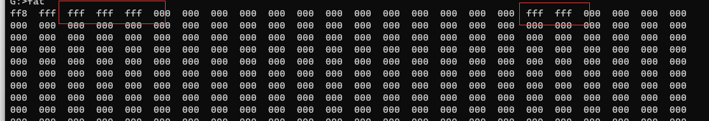
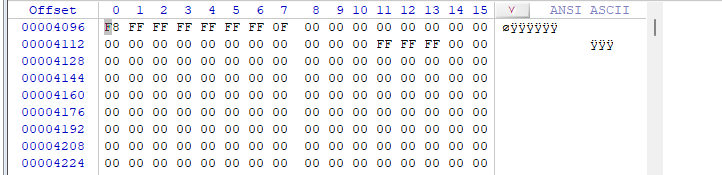
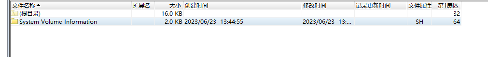
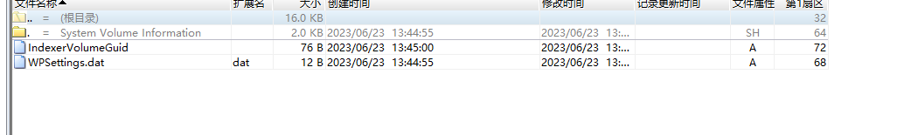
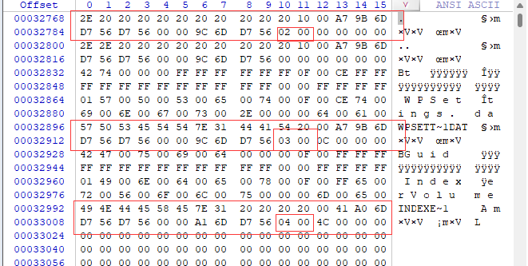
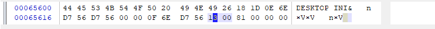
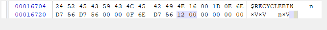

# 问题:在空目录下为什么会出现多几个fff?

# 解答：

通过WinHex文件可以得知，读取是没有问题的。

但其实在空文件的状态下还会有可以系统目录

这是该目录在文件控制块，可以知道对应首蔟号为02，03，04，刚好对应着多的几个FFF。这样就可以解释为什么多几个FFF。

这里的十六进制的12，13刚好对应18，19是剩下的两个FFF。存储是一些系统文件。

这里存储的是一些被删除的文件的信息。

自此问题得到解决。