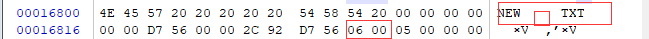

# 1. 基本信息

|  姓名  |     学号     |   班级   | 是否抄袭 | 是否分组 |
| :----: | :----------: | :------: | :------: | :------: |
| 庄佳强 | 202121331104 | 计算2114 |    否    |    否    |

**实现功能**

- [✔ ] 打印当前目录下所有文件和目录名，类似于`ls`简易版
- [✔ ] 打印文件/目录的文件控制块
- [ ✔] 打印整个文件分配表
- [✔ ] 切换目录，类似于`cd`功能
- [✔ ] 创建文件 、创建目录
- [✔ ] 删除文件、 删除目录
- [ ✔] 其他


## 1.1测试前状态

BPB图


根目录图


FCB表


FAT表


对应为什么除了第一位ff8 和第二位是fff，还有几个是FFF？

**解答：**


通过WinHex文件可以得知，读取是没有问题的。


但其实在空文件的状态下还会有可以系统目录


这是该目录在文件控制块，可以知道对应首蔟号为02，03，04，刚好对应着多的几个FFF。这样就可以解释为什么多几个FFF。


这里的十六进制的12，13刚好对应18，19是剩下的两个FFF。存储是一些系统文件。

这里存储的是一些被删除的文件的信息。

自此问题得到解决。


##   1.2实现功能的指令

```c
printf("可用命令如下: \n");
printf("ls [目录]: 显示目录下的文件列表\n");
printf("cd [目录]: 切换到指定的目录\n");
printf("touch [文件]: 创建一个新的文件\n");
printf("mkdir [文件夹]: 创建一个新的文件文件夹\n");
printf("rm [文件/目录]:删除文件或者目录"); 
printf("fcb 查看当前目录的文件控制块\n");
printf("fat 查看当前目录的文件表\n");
printf("touch:添加文件\n");
printf("cat:查看文件内容\n");
printf("help:显示帮助信息\n");
```


# 2. 功能1：实现ls简易版

## 2.1 实现思路及伪代码

**2.1.1实现思路**

首先进入到while循环中，依次读取根目录区或者数据区的32个字节到文件控制块结构体中，接着判断首字节的状态，如果为0就是退出循环，为0x2E或者0xE5表示不是需要的，如果为文件或者目录，就输出结构体中的DIR_Name（文件名）和DIR_Type（类型）,之后再次循环。

------

**2.1.2伪代码**

```c
while(1){//进入循环
    读取当前所在目录;
    disk_read(文件控制块,当前目录地址偏移量，块大小);//读取
    if(首字节==0)
        break;
    if(首字节==0x2E||首字节==0xE5)
        continue;
    if(类型==0x10){
        输出为目录；
    }
    else if(类型==0x20){
        输出为文件；
    }
}
```


## 2.2 完整的源代码

2.2.1使用到的结构体：

```c

//记录目录切换列表栈
typedef struct
{
    int top;  //栈顶
    DWORD Used[100];//存储当前目录的偏移地址量
    char *Usedname[100];
}UDStrack; 


/*
 * FAT12/16引导扇区信息
 * 关闭内存对齐优化，方便一次性读取赋值
 */
#pragma pack(1)
struct fat_boot_sector
{
    //一个跳转指令
    u8 BS_jmpBOOT[3];
    //厂商名
    u8 BS_OEMName[8];
    // 每个扇区字节数 512
    u16 BPB_BytesPerSec;
    // 每簇扇区数 1
    u8 BPB_SecPerClus;
    // boot引导占扇区数 1
    u16 BPB_ResvdSecCnt;
    //一共有几个FAT表 2
    u8 BPB_NumFATs;
    //根目录文件最大数  0xe0 = 224
    u16 BPB_RootEntCnt;
    //扇区总数  0xb40 = 2880
    u16 BPB_TotSec16;
    //介质描述符  0xf0
    u8 BPB_Media;
    //每个FAT表占扇区数 12
    u16 BPB_FATSz16;
    // 每个磁道占扇区数 0x12
    u16 BPB_SecPerTrk;
    // 磁头数   0x2
    u16 BPB_NumHeads;
    // 隐藏扇区数 0
    u32 BPB_HiddSec;
    // 如果BPB_TotSec16=0,则由这里给出扇区数 0
    u32 BPB_TotSec32;
    // INT 13H的驱动号 0
    u8 BS_DrvNum;
    //保留，未用    0
    u8 BS_Reserved1;
    //扩展引导标记  0x29
    u8 BS_BootSig;
    // 卷序列号 0
    u32 BS_VollD;
    // 卷标 'yxr620'
    u8 BS_VolLab[11];
    // 文件系统类型 'FAT12'
    u8 BS_FileSysType[8];

};
#pragma pack()


struct bios_pram_block
{
    u16 byte_per_sec;   /* 每个扇区的字节数 */
    u8 sec_per_clus;    /* 每个簇的扇区数 */
    u16 rsvd_sec_cnt;   /* 保留扇区总数(包括引导扇区) */
    u8 num_fats;        /* FAT数量 */
    u16 root_ent_cnt;   /* 根目录条目数量上限 */
    u16 sec_per_fat;    /* 每个FAT占用扇区数 */
    u32 tot_sec;        /* 扇区总数 */
    /* FAT12/16 EPBP */
    u32 vol_id;
    u8 vol_lab[11];
    u8 fs_type[8];
};

//文件描述符定义
typedef struct FileDescriptor
{
    u8 DIR_Name[8];   //文件名
    u8 DIR_Type[3];   //文件类型/扩展名
    u8 DIR_Attr;      //文件类型
    u8 Reserved[10];  //保留位
    u16 WrtTime;      //最后一次写入时间
    u16 WrtDate;      //最后一次写入日期
    u16 DIR_FstClus;  //此条目对应的开始簇数
    u32 DIR_FileSize; //文件大小
} __attribute__((packed)) FileDescriptor;
```

2.2.2简易ls指令代码

```c
int File_control_block_size = 32;//每个文件控制块大小
void ls(const char* dir, struct bios_pram_block* bpb, UDStrack* udstrack)
{
    
    //遍历根目录区
    int i = 0;
    for (; i < 1024; i++) {
        FileDescriptor tempFp;
       	//printf("%ld\n",BPB_num); 
       	//printf("%u",udstrack->Used[udstrack->top]) ;
        disk_read(&tempFp,udstrack->Used[udstrack->top] + i * File_control_block_size,File_control_block_size);
        if(strlen(tempFp.DIR_Name)==0){
        	break;
		}
		if(tempFp.DIR_Name[0]==0x2E){
			continue;
		}
		//读出是目录 
		if(tempFp.DIR_Attr==0x10&&tempFp.DIR_Name[0]!=0xE5){
			printf(".");
			int j=0;
			for(;j<8;j++){
				if(tempFp.DIR_Name[j]==' ')
				break;
				printf("%c",tempFp.	DIR_Name[j]);
			}
			printf("\t");
	    }
	    //读出是文件 
	    else if(tempFp.DIR_Attr==0X20&&tempFp.DIR_Name[0]!=0xE5){
	    	int j=0;
	    	for(;j<8;j++){
	    		if(tempFp.DIR_Name[j]==' ')
				break; 
				printf("%c",tempFp.DIR_Name[j]);
			}
			printf(".");
			 j=0;
			for(;j<3;j++){
			if(tempFp.DIR_Name[j]==' ')
				break;  
				 
				printf("%c",tempFp.DIR_Type[j]);
			} 
			printf("\t");
		}
    }
    printf("\n");
}
```


## 2.3 测试


在空目录下ls是不会有东西的，之后我在创建文件/目录后会在ls。


# 3. 功能2：创建文件/目录

## 3.1 实现思路及伪代码

这一步相当于软件设计。给出你的实现思路，必要时，可以用流程图辅以说明。给出伪代码。

**3.1.1**实现思路

创建文件：为了方便创建文件，我先把输入的字符全部转化成大写，，之后对写入的字符进行分割，为文件名和文件类型，创建一个32字节的buff数组用于存储文件控制块，之后把文件名（不足补空）,文件后缀（不足补空），文件类型,保留区，时间，日期，首蔟号，文件大小数据一个个存入进去，之后遍历当前目录，寻找一个空32字节的地方存储文件控制块，之后存入就可以了。

创建目录：基本和创建文件相似，只是文件类型需要修改和文件在存入首蔟号时，需要从FAT_After_Convert表（转化后）中寻找一个000的蔟块号用于存储目录内容，目录是需要首蔟号的，之后还要修改磁盘中fat1表和fat2表，然后就可以使用目录。

**3.1.2伪代码**

```c
touch{
    转化文件名称为大写;
    读入当前的目录偏移地址;
    分割文件名和文件后缀;
    给buff数组中依次填充
        文件名（不足补空）,
        文件后缀（不足补空），
        文件类型,
        保留区，
        时间，
        日期，
        首蔟号，
        文件大小;
    for(){
        disk_read(文件控制块,当前目录地址偏移量，块大小);//读取
        寻找一个空闲的用于存放文件控制块区域;
    }
    disk_write(buff,寻找到的地址，buff大小);            
}
```

```c
mkdir{
     转化文件名称为大写;
    读入当前的目录偏移地址;
    分割文件名和文件后缀;
    给buff数组中依次填充
        文件名（不足补空）,
        文件后缀（不足补空），
        文件类型,
        保留区，
        时间，
        日期，
        首蔟号{
            获取当前的fat表;
            从中寻找到一个000未使用的蔟号并作为首蔟号;
            之后修改fat表中的对应的1.5字节的000未fff;
            写入到FAt1表和fat2表;
        }
        文件大小;
    for(){
        disk_read(文件控制块,当前目录地址偏移量，块大小);//读取
        寻找一个空闲的用于存放文件控制块区域;
    }
    disk_write(buff,寻找到的地址，buff大小);         
}
```


## 3.2 完整的源代码

**3.2.1 touch指令**

```c
void touch(const char* dir, struct bios_pram_block* bpb, UDStrack* udstrack) {
    char temp_dir[20];
    //转大写
    int i = 0;
    while (dir[i] != '\0') {
        temp_dir[i] = toupper(dir[i]);
        i++;
    }
    temp_dir[i] = '\0';
    //当前目录地址
    DWORD cur_offset = udstrack->Used[udstrack->top];
    //写入字符
    u8 temp_buff[32];
    //FileDescriptor new_file;
    memset(temp_buff, 0, sizeof temp_buff);
    char* filename;
    char* type;
    filename = strtok((char*)temp_dir, ".");
    type = strtok(NULL, ".");
    i = 0;
    //文件名
    while (filename[i] != '\0') {
        temp_buff[i] = filename[i];
        i++;
    }
    //补全空白
    for ( ; i < 8; i++)
        temp_buff[i] = ' ';
    
    int j = 0;
    //文件后缀
    while (type[j] != '\0')
       temp_buff[i++] =type[j++];
    //补全空白
    for (; i < 11; i++)
        temp_buff[i] = ' ';
    //文件类型
    temp_buff[i++] = 0x20;
    //保留区
    for ( ; i < 22; i++){
        temp_buff[i] = 0x00;
    }
    time_t t = time(NULL);
    struct tm* tm = localtime(&t);
    //算时间
    int hour = tm->tm_hour;    // 小时
    int minute = tm->tm_min;   // 分钟
    int second = tm->tm_sec;   // 秒钟
    int fat_time = (hour << 11) | (minute << 5) | (second / 2);
    unsigned char time_high = (fat_time >> 8) & 0xFF;  // 高字节
    unsigned char time_low = fat_time & 0xFF;          // 低字节
    temp_buff[i++] = time_low;//时间
    temp_buff[i++] = time_high;
    //算日期
    int year = tm->tm_year + 1900;  // 年份偏移量
    int month = tm->tm_mon + 1;     // 月份
    int day = tm->tm_mday;          // 日期
    int fat_date = ((year - 1980) << 9) | (month << 5) | day;
    unsigned char date_high = (fat_date >> 8) & 0xFF;  // 高字节
    unsigned char date_low = fat_date & 0xFF;          // 低字节
    temp_buff[i++] = date_low;//日期
    temp_buff[i++] = date_high;
    //文件第一簇号
    for (; i < 28; i++)
    {
        temp_buff[i] = 0x00;
    }
    //文件大小
    for (; i < 32; i++)
    {
        temp_buff[i] = 0x00;
    }
    FileDescriptor New_file;
   //查看第一个空白
    for ( i=0; i < 128; i++) {
        disk_read(&New_file, cur_offset + i * 32, 32);
        if (j < 0 && New_file.DIR_Name[0] == 0xE5 || New_file.DIR_Attr == 0) {
            j = i;
            break;
        }
        if (memcmp(New_file.DIR_Name, filename, min(sizeof(New_file.DIR_Name), sizeof(filename))) == 0) {
            printf("该文件已存在!\n");
            return;
        }
    }
    DWORD temp_offset = (cur_offset + j * 32);
    disk_write(temp_buff, temp_offset, sizeof temp_buff);
}
```


**3.2.2mkdir指令**

```c
void mkdir(const char* dir, struct bios_pram_block* bpb, UDStrack* udstrack) {
    char temp_dir[20];
    //转大写
    int i = 0;
    while (dir[i] != '\0') {
        temp_dir[i] = toupper(dir[i]);
        i++;
    }
    temp_dir[i] = '\0';
    //当前目录地址
    DWORD cur_offset = udstrack->Used[udstrack->top];
    //写入字符
    u8 temp_buff[32];
    //FileDescriptor new_file;
    memset(temp_buff, 0, sizeof temp_buff);
    char* filename;
    filename = strtok((char*)temp_dir, ".");
    i = 0;
    //文件名
    while (filename[i] != '\0') {
        temp_buff[i] = filename[i];
        i++;
    }
    //补全空白
    for (; i < 8; i++)
        temp_buff[i] = ' ';

    int j = 0;
    //文件后缀
    for (j = 0; j < 3; j++) {
        temp_buff[i++] = ' ';
   }
    //文件类型
    temp_buff[i++] = 0x10;
    //保留区
    for (; i < 22; i++) {
        temp_buff[i] = 0x00;
    }
    time_t t = time(NULL);
    struct tm* tm = localtime(&t);
    //算时间
    int hour = tm->tm_hour;    // 小时
    int minute = tm->tm_min;   // 分钟
    int second = tm->tm_sec;   // 秒钟
    int fat_time = (hour << 11) | (minute << 5) | (second / 2);
    unsigned char time_high = (fat_time >> 8) & 0xFF;  // 高字节
    unsigned char time_low = fat_time & 0xFF;          // 低字节
    temp_buff[i++] = time_low;//时间
    temp_buff[i++] = time_high;
    //算日期
    int year = tm->tm_year + 1900;  // 年份偏移量
    int month = tm->tm_mon + 1;     // 月份
    int day = tm->tm_mday;          // 日期
    int fat_date = ((year - 1980) << 9) | (month << 5) | day;
    unsigned char date_high = (fat_date >> 8) & 0xFF;  // 高字节
    unsigned char date_low = fat_date & 0xFF;          // 低字节
    temp_buff[i++] = date_low;//日期
    temp_buff[i++] = date_high;
    //文件第一簇号
    u16 Fat_after_convert[4096];
    convert_Fat(Fat_after_convert, bpb);
    j = 0;
    u16 count = 0;
    for (; j < 4096; j++) {
        if (Fat_after_convert[j] == 0) {
            count = j;
            break;
        }
            
    }
    char a = (char)count;
    temp_buff[i++] = a;
    a=(char)count>>8; 
    temp_buff[i++] = a;
    u16 fat_count = count * 3 / 2;
    //修改fat表
    u8 old_buff[2],new_buff[2];
    DWORD bpb_temp = bpb->byte_per_sec * bpb->rsvd_sec_cnt + (int)fat_count;
    disk_read(old_buff, bpb_temp, 2);
    if (count % 2 == 0) {
        new_buff[1] = old_buff[1] | 0x0f;
        new_buff[0] = 0xff;
    }
    else {
        new_buff[1] = 0xff;
        new_buff[0] = old_buff[0] | 0xf0;
    }
    //fat1
    disk_write(new_buff, bpb_temp, 2);
    //fat2
    disk_write(new_buff, bpb_temp + bpb->byte_per_sec * bpb->sec_per_fat, 2);


    for (; i < 28; i++)
    {
        temp_buff[i] = 0x00;
    }
    //文件大小
    for (; i < 32; i++)
    {
        temp_buff[i] = 0x00;
    }
    FileDescriptor New_file;
    //查看第一个空白
    for (i = 0; i < 128; i++) {
        disk_read(&New_file, cur_offset + i * 32, 32);
        if (j < 0 && New_file.DIR_Name[0] == 0xE5 || New_file.DIR_Attr == 0) {
            j = i;
            break;
        }
        if (memcmp(New_file.DIR_Name, filename, min(sizeof(New_file.DIR_Name), sizeof(filename))) == 0) {
            printf("该文件夹已存在!\n");
            return;
        }
    }
    DWORD temp_offset = (cur_offset + j * 32);
    disk_write(temp_buff, temp_offset, sizeof temp_buff);
}
```


## 3.3 测试


创建了一个叫SUBDIR的目录，可以看到创建成功，fat表分配成功，文件控制块也可以正常输出,SUBDIR目录首蔟为5，ls也正常。fat中的第5位从000变成FFF是因为目录使用了这一个蔟，而且下一个跳转为FFF。不存在。


通过查看winhex中的根目录，也可以查看出成功的存储，红框的为SUBDIR的FCB。


在根目录创建一个文件new.txt，因为如果没有写入内容，文件是不会分配蔟，所有fat没有变化，fcb中new.txt的开始蔟为0。


这时候写一点东西进去。


这时候new.txt就会有分配蔟，为6，fat表中也更新，可以正常输出。


根目录中也分配好了空间。



接着跳转到子目录下常见一个文件new.txt，依然没有蔟。


写入一些数据后，


成功的分配了开始蔟和更改fat表。


在数据区的也正常的写入。


# 4. 功能3：打印文件控制块

## 4.1 实现思路及伪代码

**4.1.1实现思路**

遍历当前目录下的字段，每32个字节为一个文件控制块，再判断是否为文件或者目录，之后打印出文件控制块结构体中的成员，其中对时间，类型部分进行转化，打印出后再次遍历，知道判断为结束。

**4.1.2伪代码**

```c
for(i){//进入循环
    读取当前所在目录;
disk_read(文件控制块,当前目录地址偏移量，块大小);//读取文件控制块
if(首字节==0)
    break;
if(首字节==0x10&&首字节==0x20||首字节==0xE5)
    continue;
//判断为可以输出
    输出对应的信息;
    其中对类型和时间进行转化;
}
```


## 4.2 完整的源代码

```c
void print_File_control_block(struct bios_pram_block* bpb,UDStrack* udstrack) {
    int i = 0;
    FileDescriptor tempFp;
    printf("文件分配表为：\n");
    printf("文件名\t\t属性\t\t类型\t\t最后一次写入时间\t\t开始蔟\t\t文件大小\n");
    for (; i < 1024; i++) {
        //printf("%ld\n",BPB_num); 
        disk_read(&tempFp, udstrack->Used[udstrack->top] + i * File_control_block_size, File_control_block_size);
        if (strlen(tempFp.DIR_Name) == 0) {
            break;
        }
       	if(tempFp.DIR_Name[0]==0x2E){
			continue;
		}
        if (tempFp.DIR_Name[0] != 0xE5 && (tempFp.DIR_Attr == 0x10 || tempFp.DIR_Attr == 0X20)) {
            int j = 0;
            //printf("文件名为:");
            for (; j < 8; j++) {
                printf("%c", tempFp.DIR_Name[j]);
            }
            printf("\t");
            j = 0;
            for (; j < 3; j++) {
                if (tempFp.DIR_Name[j] == ' ')
                    break;
                printf("%c", tempFp.DIR_Type[j]);
            }
            printf("\t\t");
           // printf("文件为:");
           if(tempFp.DIR_Attr==16){
           	printf("目录\t\t");
		   }
		   else if(tempFp.DIR_Attr==32){
		   	printf("文件\t\t");
		   }
		   
           // printf("最后一次写入时间为:");
           //利用算法分析时间 
           int date_y=((tempFp.WrtDate>>9)&0x7f)+1980;
           int date_m=((tempFp.WrtDate>>5)&0x0f);
           int date_d=tempFp.WrtDate&0x1f; 
           printf("%04d/%02d/%02d  ",date_y,date_m,date_d);
           int time_h=(tempFp.WrtTime>>11)&0x1f;
           int time_m=(tempFp.WrtTime>>5)&0x3f;
           int time_s=(tempFp.WrtTime&0x1f)*2;
           printf("%02d:%02d:%02d\t\t",time_h,time_m,time_s);
           
           // printf("此条目对应的开始簇数为:");
            printf("%u\t\t", tempFp.DIR_FstClus);
           // printf("文件大小为:");
            printf("%u", tempFp.DIR_FileSize);
            printf("\n");
            //printf("文件名: %s文件类型: %s文件属性: %u保留位: %s最后一次写入时间: %u最后一次写入日期: %u此条目对应的开始簇数: %u文件大小: %u\n"
            //,tempFp.DIR_Name,tempFp.DIR_Type,tempFp.DIR_Attr,tempFp.DIR_Attr,tempFp.Reserved,tempFp.WrtTime,tempFp.WrtDate,tempFp.DIR_FstClus,tempFp.DIR_FileSize);
             //printf("\n");
        }

    }
}
```


## 4.3 测试

打印为根目录的文件控制块。


------


# 5. 功能4：打印整个文件分配表

## 5.1 实现思路及伪代码

这一步相当于软件设计。给出你的实现思路，必要时，可以用流程图辅以说明。给出伪代码。

**5.1.1实现思路**

首先创建一个数组用于存储从1字节转化为1.5字节的fat表项。之后进行对字节的转化，具体为先从磁盘中读取3个字节，之后对他们进行处理，奇数取前一个字节高4位和下一个字节，偶数取第一个字节和下一个字节低4位，之后存储到FAT_After_Convert表中。然后输出FAT_After_Convert就可以输出文件分配表。但这样过于简单，我又在基础上，遍历了当前目录中的所有文件和目录的所使用的所有蔟。先遍历目录中的所有文件/目录，然后对查看每一个文件/目录的首个蔟号，再到FAT_After_Convert表一个个找对应到下一个蔟，到最后为结束符，之后连接起来输出。

**5.1.2伪代码**

```c
初始化数组
fat{
    读取当前所在目录;
    //获得fat表
    
convert_fat(FAT_After_Convert表,BPB);


while(1){
    disk_read(文件控制块,当前目录地址偏移量，块大小);//读取
    if(首字节==0)
        break;
    if(首字节==0x2E||首字节==0xE5)
        continue;
    if(类型==0x10){
        输出为目录名；
    }
    else if(类型==0x20){
        输出为文件名；
    }
    num=文件控制块的首蔟号;
    输出当前文件控制块的首蔟号；
        while(下一个蔟号 != 0xff8&&下一个蔟号 !=0xfff&&下一个蔟号!=0x0){
            temp_num = Fat_after_convert[num];//存储下一个蔟号
             输出蔟号;
             num=temp_num;
        }
    printf("EOF\n");//输出结束
}

}
convert_fat{
        //取第二个低4位往前推8位+第一个
        FAT_After_Convert[index] = (u16)(buff[1] & 0b00001111) << 8 | buff[0];
        //取第个高4位+第三个往后推4位
        FAT_After_Convert[index + 1] = ((u16)buff[1] & 0b11110000 | (u16)(buff[2]) << 8) >> 4;
}


```


## 5.2 完整的源代码

```c
//转化8位为12位，并获取转化为的FAT_After_Convert表
void convert_Fat(u16* FAT_After_Convert, struct bios_pram_block* bpb) {
    u8 buff[3];
    DWORD OffSet = bpb->byte_per_sec * bpb->rsvd_sec_cnt;
    int i = 0;
    int size=3;
    int index=0;
    //bpb->sec_per_fat*bpb->byte_per_sec
    for (; i < bpb->sec_per_fat * bpb->byte_per_sec/3; i++, OffSet += 3) {
        //每3个项一组，合成2个fat表项，放在FAT_After_Convert中 
        disk_read(buff, OffSet, size);
        //取第二个低4位往前推8位+第一个
        FAT_After_Convert[index] = (u16)(buff[1] & 0b00001111) << 8 | buff[0];
        //取第个高4位+第三个往后推4位
        FAT_After_Convert[index + 1] = ((u16)buff[1] & 0b11110000 | (u16)(buff[2]) << 8) >> 4;
        index += 2;
    }
}


int Num_Of_Fat = 4096;
void fat(struct bios_pram_block* bpb, UDStrack* udstrack) {
    DWORD BPB_temp = udstrack->Used[udstrack->top];
    u16 Fat_after_convert[Num_Of_Fat];
    memset(Fat_after_convert, 0, Num_Of_Fat);
    FileDescriptor temp_File;
    convert_Fat(Fat_after_convert, bpb);
    int i = 0;
//    for (; i < Num_Of_Fat; i++) {
//        printf("%03x  ", Fat_after_convert[i]);
//    }
    while (1) {
        disk_read(&temp_File, BPB_temp, sizeof(temp_File));
        BPB_temp += 32;
        if (temp_File.DIR_Name[0] == '\0') {
            break;
        }
        if (temp_File.DIR_Name[0] == 0XE5 || temp_File.DIR_Name[0] == 0x2E||temp_File.DIR_Attr & 0b00000010) {
            continue;
        }

        //读出是目录
        if (temp_File.DIR_FstClus != 0) {
            if (temp_File.DIR_Attr == 0x10) {
                printf(".");
                int j = 0;
                for (; j < 8; j++) {
                    if (temp_File.DIR_Name[j] == ' ')
                        break;
                    printf("%c", temp_File.DIR_Name[j]);
                }
            }
            //读出是文件 
            else if (temp_File.DIR_Attr == 0X20) {
                int j = 0;
                for (; j < 8; j++) {
                    if (temp_File.DIR_Name[j] == ' ')
                        break;
                    printf("%c", temp_File.DIR_Name[j]);
                }
                printf(".");
                j = 0;
                for (; j < 3; j++) {
                    if (temp_File.DIR_Name[j] == ' ')
                        break;

                    printf("%c", temp_File.DIR_Type[j]);
                }
            }
            printf(":"); 
            int num = temp_File.DIR_FstClus;
            int temp_num; 
            printf("%lu->", num);
            while (Fat_after_convert[num] != 0xff8&&Fat_after_convert[num] !=0xfff&&Fat_after_convert[num] !=0x0 ) {
            	temp_num = Fat_after_convert[num];
                printf("%lu->", temp_num);
                num=temp_num;
            }
            printf("EOF\n");
        }
    }
}
```


## 5.3 测试

写入一些数据后

打印fat表(部分)


当前目录的文件使用的蔟连接


# 6. 功能5：类似`cd`功能

## 6.1 实现思路及伪代码

这一步相当于软件设计。给出你的实现思路，必要时，可以用流程图辅以说明。给出伪代码。

**5.1.1实现思路**

cd作为我实验中最主要的部分之一，他是实现我的目录记录栈能不能正常进行，目录记录栈能不能正常进行是实现其他功能能否在不同目录下进行的关键。

先查看使用cd的类型，如果为 .. 表示要进行返回前一个目录，这是只需要出栈就可以实现。

要是实现的是跳转目录，先从栈中获得当前目录的地址偏移量，之后遍历当前目录下的所有文件控制块，找到要跳转的目录，没找到不做操作，找到后计算目录的地址偏移量—>

`BPB_temp = (bpb->sec_per_fat * bpb->num_fats + bpb->rsvd_sec_cnt) *bpb->byte_per_sec + 32 * bpb->root_ent_cnt + (num - 2) * bpb->byte_per_sec * bpb->sec_per_clus;`

之后就是存储到给目录栈，记录跳转目录的信息。

**6.1.2伪代码**

```c
cd{
    if(dir==".."){
        出栈;
    }
    else{//需要跳转目录
        将多个目录进行分割;
        获得当前目录的地址偏移量;
        disk_read(文件控制块,当前目录地址偏移量，块大小);//读取
         if(当前读取的文件控制块为目录){
             if(判断目录是否对上){
                 读取文件控制块的首蔟号;
                 把蔟号对应的蔟块地址偏移量写入到目录栈中;
                 跳到下一个目录名;
             }
             
         }
            
    }
}
```


## 6.2 完整的源代码

```c
void cd(const char* dir, struct bios_pram_block* bpb, UDStrack* udstrack) {
    //返回前目录 
    //printf("%s", dir);
    if (dir[0] == '.' && dir[1] == '.') {
        if (udstrack->top > 0) {
            udstrack->top--;
        }
    }
    else {
        //获得栈中最前面的目录地址
        DWORD BPB_temp = udstrack->Used[udstrack->top];
        char* character;
        //分割字符串
        character = strtok((char*)dir, "/");
        //printf("%s", character);
        FileDescriptor tempFp;
        char filename[14];
        while (character != NULL) {
            disk_read(&tempFp, BPB_temp, File_control_block_size);
            BPB_temp += 32;
            if (tempFp.DIR_Name[0] == 0xE5) {
                continue;
            }
            if (strlen(tempFp.DIR_Name) == 0) {
                break;
            }
            //找到是目录 
            if (tempFp.DIR_Attr == 0x10) {
                //提取文件名 
                memset(filename, 0, sizeof(filename));
                int index = 0;
                int j = 0;
                for (; j < 8; j++) {
                    if (tempFp.DIR_Name[j] == ' ') {
                        break;
                    }
                    filename[index++] = tempFp.DIR_Name[j];
                }
                //printf("%s", filename);
                if (strcmp(character, filename) == 0) {
                    u16 num = tempFp.DIR_FstClus;
                    //跳转到对应数据区
                    //bpb->sec_per_fat * num_fats + bpb->rsvd_sec_cnt ) *byte_per_sec到根目录区
                    //再加上32*  bpb->root_ent_cnt 到数据区
                    //(num - 2) * byte_per_sec * bpb->sec_per_clus到指定的蔟号中
                    BPB_temp = (bpb->sec_per_fat * bpb->num_fats + bpb->rsvd_sec_cnt) *
                    bpb->byte_per_sec + 32 * bpb->root_ent_cnt + (num - 2) * bpb->byte_per_sec * bpb->sec_per_clus;
                    //BPB_temp = (bpb->sec_per_fat * 2 + bpb->rsvd_sec_cnt + 32) *512 + (num - 2) * 512 * 4;
                  
                    udstrack->top++;
                    udstrack->Used[udstrack->top] = BPB_temp;
                    //记得分配空间
                    udstrack->Usedname[udstrack->top]=malloc(sizeof(character));
                    strcpy(udstrack->Usedname[udstrack->top], character);
                    character = strtok(NULL, "/");
                }
            }

        }
    }
}

```


## 6.3 测试

使用cd subdir 跳转到subdir成功，cd ..返回上一个目录成功。


# 7. 功能6：删除文件/目录

## 7.1 实现思路及伪代码

**7.1.1实现思路**

先获得当前的目录偏移量，之后一个个读取文件控制块，判断是否为要删除的文件或者目录。

如果是就先把文件控制块的首字节更改为0xE5表示该控制块目录项为空闲的，未被使用。

之后对fat表进行操作，先遍历整个fat表找到他对应的蔟号，之后通过蔟号*1.5找到在磁盘中fat存放的位置，之后把他转化成000就完成的整体的删除。

**7.1.2伪代码**

```c
rm{
    获取当前目录的地址偏移量;
    while(1){
         disk_read(文件控制块,当前目录地址偏移量，块大小);//读取
        if(目录首字节==0){
            break；
        }
        if(首字节==0xE5&&首字节==0x2E||类型& 0b00000010){
            当前目录地址偏移量+=32;
            continue;
        }
        if(读取的目录为要删除的){
            目录首字节更改为0xE5;
            disk_read(文件控制块,当前要删除目录地址偏移量，块大小);//读取
            遍历当前的fat表;
            u8 old_buff[2], new_buff[2];
            while(目录使用蔟号不为0xfff){
                 disk_read(old_buff, 要删除的fat字节的地址, 2);
                把磁盘中的对应的改为000;
                disk_write(new_buff,当前目录偏移量, 2);
                下一个蔟号;             
            }
        }
          当前目录地址偏移量+=32;
   }
}
```


## 7.2 完整的源代码

```c
void rm(const char* dir, struct bios_pram_block* bpb, UDStrack* udstrack) {
    DWORD BPB_temp = udstrack->Used[udstrack->top];
    FileDescriptor temp_File;
    while (1) {
        disk_read(&temp_File, BPB_temp, sizeof(temp_File));
        
        if (temp_File.DIR_Name[0] == '\0') {
            break;
        }
        if (temp_File.DIR_Name[0] == 0XE5 || temp_File.DIR_Name[0] == 0x2E || temp_File.DIR_Attr & 0b00000010) {
           BPB_temp += 32;
		    continue;
        }
        char filename[14];
        memset(filename, 0, sizeof(filename));
        int index = 0;
        int j = 0;
        for (; j < 8; j++) {
            if (temp_File.DIR_Name[j] == ' ') {
                break;
            }
            filename[index++] = temp_File.DIR_Name[j];
        }
        //printf("%s", filename);
        if (strcmp(dir, filename) == 0) {
            temp_File.DIR_Name[0] = 0xE5;
            disk_write(&temp_File, BPB_temp, 32);

            u16 Fat_after_convert[4096];
            convert_Fat(Fat_after_convert, bpb);
            
            u16 count = temp_File.DIR_FstClus;
            u16 count_temp;
            u8 old_buff[2], new_buff[2];
            while (count != 0xfff && count != 0) {
                u16 fat_count = count * 3 / 2;
                //修改fat表
                DWORD bpb_temp = bpb->byte_per_sec * bpb->rsvd_sec_cnt + (int)fat_count;
                disk_read(old_buff, bpb_temp, 2);
                if (count % 2 == 0) {
                    new_buff[1] = old_buff[1] & 0xf0;
                    new_buff[0] = 0x00;
                }
                else {
                    new_buff[1] = 0x00;
                    new_buff[0] = old_buff[0] & 0x0f;
                }
                //fat1
                disk_write(new_buff, bpb_temp, 2);
                //fat2
                disk_write(new_buff, bpb_temp + bpb->byte_per_sec * bpb->sec_per_fat, 2);
                count_temp = Fat_after_convert[count];
                count = count_temp;

            }
        }
        BPB_temp += 32;
    }
    
}

```


## 7.3 测试

删除根目录下的new.txt


可以看出文件控制块消失了，fat表中使用的蔟也重新归为000。表示删除已经完成。


原来的文件首字节更改为0xE5表示删除。

# 8. 功能7：额外(实现简易cat)

## 8.1 实现思路及伪代码

**8.1.1实现思路**

和删文件差不多，先获得当前的目录偏移量，之后一个个读取文件控制块，判断是否为要cat的文件，只是把删操作改为读取一个蔟的操作。

**8.1.2伪代码**

```c
 获取当前目录的地址偏移量;
    while(1){
         disk_read(文件控制块,当前目录地址偏移量，块大小);//读取
        if(目录首字节==0){
            break；
        }
        if(首字节==0xE5&&首字节==0x2E||类型& 0b00000010){
            当前目录地址偏移量+=32;
            continue;
        }
        if(读取的目录为要cat的){
            BPB_temp= (bpb->sec_per_fat * 2 + bpb->rsvd_sec_cnt + 32) * 512 + (temp_File.DIR_FstClus - 2) * 512 * 4;
          int file[2049];//文件大小
            disk(file,读取的地地址,2048);
            打印;
        }
        当前目录地址偏移量+=32;
    }
}
```


## 8.2 完整的源代码

```c
void convert_Fat(u16* FAT_After_Convert, struct bios_pram_block* bpb) {
    u8 buff[3];
    DWORD OffSet = bpb->byte_per_sec * bpb->rsvd_sec_cnt;
    int i = 0;
    int size=3;
    int index=0;
    //bpb->sec_per_fat*bpb->byte_per_sec
    for (; i < bpb->sec_per_fat * bpb->byte_per_sec/3; i++, OffSet += 3) {
        //每3个项一组，合成2个fat表项，放在FAT_After_Convert中 
        disk_read(buff, OffSet, size);
        //取第二个低4位往前推8位+第一个
        FAT_After_Convert[index] = (u16)(buff[1] & 0b00001111) << 8 | buff[0];
        //取第个高4位+第三个往后推4位
        FAT_After_Convert[index + 1] = ((u16)buff[1] & 0b11110000 | (u16)(buff[2]) << 8) >> 4;
        index += 2;
    }
}
void cat(const char* dir, struct bios_pram_block* bpb, UDStrack* udstrack) {
    DWORD BPB_temp = udstrack->Used[udstrack->top];
     FileDescriptor temp_File;
    while (1) {
        disk_read(&temp_File, BPB_temp, sizeof(temp_File));
        BPB_temp += 32;
        if (temp_File.DIR_Name[0] == '\0') {
            break;
        }
        if (temp_File.DIR_Name[0] == 0XE5 || temp_File.DIR_Name[0] == 0x2E || temp_File.DIR_Attr & 0b00000010) {
            continue;
        }
        char filename[14];
        memset(filename, 0, sizeof(filename));
        int index = 0;
        int j = 0;
        for (; j < 8; j++) {
            if (temp_File.DIR_Name[j] == ' ') {
                break;
            }
            filename[index++] = temp_File.DIR_Name[j];
        }
        //printf("%s", filename);
        if (strcmp(dir, filename) == 0) {
            BPB_temp= (bpb->sec_per_fat * 2 + bpb->rsvd_sec_cnt + 32) * 512 + (temp_File.DIR_FstClus - 2) * 512 * 4;
                int file[2049];
                disk_read(file, BPB_temp, 2048);
                printf("%s", file);
                printf("\n");
        }
    }
}

```


## 8.3 测试

打印SUBDIR目录中的new.txt中的内容，成功。


