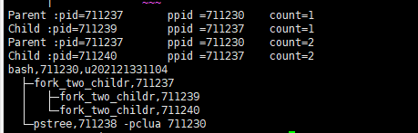

# 进程与线程

## 1. 基本信息

|  姓名  |     学号     |   班级   | 是否编译成功 | 是否运行结果正确（逻辑也要正确） |
| :----: | :----------: | :------: | :----------: | :------------------------------: |
| 庄佳强 | 202121331104 | 计算2114 |      是      |                是                |

## 2. 实现思路及源代码

实验很简单，但是只是完成实验有点没意思。所有我去查了一下父进程与子进程在创造时候发生了什么？

______
在调用fork() 函数之后，操作系统会创建一个子进程，该子进程是父进程的一个完整副本，子进程会复制以下部分:

1. 父进程的代码段（text segment）。
2. 父进程的数据段（data segment）和 BSS 段（bss segment）。
3. 父进程的堆（heap）。
4. 父进程的用户栈（user stack）。
5. 父进程的文件描述符表（file descriptor table）。
6. 父进程的信号处理设置和信号等待状态。
7. 父进程的进程上下文（process context）和内核栈（kernel stack）。

子进程会复制父进程的所有资源，但是子进程会拥有自己独立的地址空间，因此父进程和子进程之间的地址空间是相互独立的。这意味着，如果父进程或子进程修改了自己的地址空间中的某个变量，不会影响到另外一个进程的变量。

所以在案例中，子进程会复制父进程中的堆区的全局变量。


理解这些后，就可以写实验。

### 实验思路

先设置一个全局变量count 用于标记子线程的编号。之后创建第一个进程返回 Pid并对他判断，对子进程而言，会打印出子进程的pid ppid count 的信息。对于父进程而言，会打印出父进程的pid ppid count 的信息，并且会继续创建第二个进程返回 Pid并对他判断。同理对子进程而言，会打印出子进程的pid ppid count 的信息。对于父进程而言，会打印出父进程的pid ppid count 的信息。这些进程都要sleep()；让pstree打印出线程树。


### 代码

```c++
#include <stdio.h>
#include <unistd.h>
#include <sys/types.h>
#include <stdlib.h>
#include <string.h>
//#include <sys/wait.h>

int count = 0;
int main() {

	//常见一个子进程 
	pid_t p1 = fork();
	count++;
	if (p1 < 0) {//创建失败 
		exit(-1);
	}
	else if (p1 == 0) {//如果是子进程 
		printf("Child :pid=%d \t ppid =%d \t count=%d\n",getpid(),getppid(),count);
		sleep(5);
	}
	else {
		printf("Parent :pid=%d \t ppid =%d \t count=%d\n",getpid(),getppid(),count);
		//放在这里防止子进程再建立一个子进程 
		pid_t p2 = fork();//在父进程中在建立一个子进程
		count++; 
		if (p2 < 0) {//创建失败 
			exit(-1);
		}
		else if (p2 == 0) {//如果是子进程 
			printf("Child :pid=%d \t ppid =%d \t count=%d\n",getpid(),getppid(),count);
			sleep(5);
		}

		else {
			printf("Parent :pid=%d \t ppid =%d \t count=%d\n",getpid(),getppid(),count);
			sleep(5);
		}
		sleep(5);
	}
	//printf("In the end :count=%d\n",count);
	return 0;
}
```


## 3. 打印进程树




```
Parent :pid=711237 	 ppid =711230 	 count=1
Child :pid=711239 	 ppid =711237 	 count=1
Parent :pid=711237 	 ppid =711230 	 count=2
Child :pid=711240 	 ppid =711237 	 count=2
bash,711230,u202121331104
  ├─fork_two_childr,711237
  │   ├─fork_two_childr,711239
  │   └─fork_two_childr,711240
  └─pstree,711238 -pclua 711230

```


## 4. 实验过程中遇到的问题及解决方法

一开始做完之后，我正常的执行代码，发现程序在打印完父进程和子进程的信息后就跳出来执行，但之后又会执行出打印结束。

如：


```
Parent :pid=714838 	 ppid =714832 	 count=1
Child :pid=714840 	 ppid =714838 	 count=1
Parent :pid=714838 	 ppid =714832 	 count=2
Child :pid=714841 	 ppid =714838 	 count=2
bash,714832,u202121331104
  ├─fork_two_childr,714838
  │   ├─fork_two_childr,714840
  │   └─fork_two_childr,714841
  └─pstree,714839 -pclua 714832
u202121331104@jmu-cs:~/os_exp/exp2_process$ In the end :count=1
In the end :count=2
In the end :count=2

```

解决方法：尝试了wait()函数没有效果后，后面我看了compile_and_run.sh后 发现了他把程序切到了后台进行，之后进行pstree 打印进程树，那没办法，我只能把打印结束删除。

