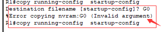

# 实验二

## 1. 基本信息

|  姓名  |     学号     |   班级   | 本次是否有抄袭 | 所选协议 |
| :----: | :----------: | :------: | :------------: | :------: |
| 庄佳强 | 202121331104 | 计算2114 |       否       |   SSH    |

## 2. 使用Cisco Packet Tracer遇到的问题及解决方法

路由器搭设中:

跟着步骤走时，出现了这个问题，一开始以为是要确认就输入了Yes,但出现bug,后面看来报错才知道要输入的是文件名，但我也不知道文件名是什么，以为是自己建立一个文件，就以为命名为Go，但依然错误，不知所措。

解决方法：百度才知道其实是用已有的文件，默认为startup-config,输入后就完成了。

## 3. Wireshark抓取报文

**（1）如何抓取到你所选择的协议报文**

我是通过抓取所有的报文，再通过ip筛选得到自己的报文。

**（2）Wireshark出来很多报文，你是如何过滤出与你所选协议相关的报文**

我是通过先抓取一堆报文，再通过用筛选器通过ip不同的情况筛选出SSH协议部分来查看，从而实现抓取特定的协议。

## 4. 协议时序图

## 5. 分析SSH协议工作原理

1. 建立连接：主机向服务器发起连接请求，服务器接收到请求后，会发送确认响应，表示连接已经建立。其中用到了tcp协议,因为SSH是通过TCP通信来实现，先是tcp三段报文连接。连接之后，相互交换自己使用的协议和版本。

2. 身份认证：主机向服务器发送身份认证信息，主机向服务器发送公钥，服务器给主机发送公钥，之后发送TCP确认报文相互确认。

3. 加密通信：认证通过后，服务器和客户端之间建立一个加密通道，所有的数据都会在通道内进行加密传输，确保数据的安全性和保密性，可见传输的数据都没有内容。在第7，8句中，之后他们还会通过算法更新获得了一个对称密钥。

4. 数据传输：建立加密通道后，客户端和服务器之间可以进行数据传输，包括文件传输、命令执行等。

5. 断开连接：当客户端或服务器需要断开连接时，会发送断开连接请求，服务器收到请求后，会关闭连接，其中主机向服务器提出FIN.ACK请求，然后服务器向主机回复FIN.ACK请求,主机再最后向服务器回复ACK确认请求，完成。

## 6. 遇到的问题及解决方法

1.一开始是直接过滤出ssh协议，但过滤出来的抓包怎么分析都不合适，ssh中还惨了一个tcp协议，我陷入了苦思。

解决方法：在网上查询资料后，发现SSH协议是通过TCP协议通信的，那应该会有TCP连接和ACK确认，但我的过滤抓包中没有，我感觉可能是我的过滤方式有误，之后我反复观察SSH连接中的共同点，我发现可以通过ip过滤，来过滤出两个对于的通信，之后就出现完整的ssh协议连接过程，可以进行分析。

2.

这里的更新keys不知道是更新公钥还是更新对称密钥。

解决方法：在查阅了一些资料后得到：

Elliptic Curve Diffie-Hellman Key Exchange Init（ECDH Init）是SSH连接中的一部分，用于在客户端和服务器之间协商一个共享的加密密钥。这个密钥将用于在SSH连接中加密和解密数据，以确保数据的机密性和完整性。ECDH Init是SSH协议中的一种密钥交换协议，它使用椭圆曲线算法来生成密钥。在ECDH Init协议中，客户端和服务器会协商一个共享的椭圆曲线和一个基点，然后各自生成一个私钥和公钥，并将公钥发送给对方。然后，客户端和服务器会使用对方的公钥和自己的私钥来计算一个共享的密钥，这个密钥将用于在SSH连接中进行加密和解密操作。

ECDH Init协议的作用是确保SSH连接中的数据传输是安全的。在SSH连接中，所有的数据都会在加密通道中进行传输，如果没有共享的密钥，则无法进行加密和解密操作。因此，ECDH Init协议的作用是确保客户端和服务器之间协商一个共享的密钥，以保证数据的安全性和保密性。
总之，ECDH Init是SSH连接中的一部分，用于在客户端和服务器之间协商一个共享的加密密钥，以确保数据的机密性和完整性。                                                                    —by chatGPT

得知了这里是在更新获得一个协商的对称密钥，用于进行加密和解密操作。